## IEEE TRANSACTIONS ON INSTRUMENTATION AND MEASUREMENT, VOL. 73, 2024

## 2001611

# YOLO-HMC: An Improved Method for PCB Surface Defect Detection

Minghao Yuan®, Yongbing Zhou®, Xiaoyu Ren®, Hui Zhi®, Jian Zhang®, and Haojie Chen®

Abstract— The surface defects of printed circuit boards (PCBs) generated during the manufacturing process have an adverse effect on product quality, which further directly affects the stability and reliability of equipment performance. However, there are still great challenges in accurately recognizing tiny defects on the surface of PCB under the complex background due to its compact layout. To address the problem, a novel YOLO- HorNet-MCBAM-CARAFE (YOLO-HMC) network based on improved YOLOv5 framework is proposed in this article to identify the tiny-size PCB defect more accurately and efficiently with fewer model parameters. First, the backbone part adopts the HorNet for enhancing the feature extraction ability and deepening the information interaction. Second, an improved multiple convolutional block attention module (MCBAM) is designed to improve the ability of the model to highlight the defect location from a highly similar PCB substrate background. Third, the content-aware reassembly of features (CARAFE) is used to replace the up-sampling layer for fully aggregating the contextual semantic information of PCB images in a large receptive field. Moreover, aiming at the difference between PCB defect detection and natural detection, the original model detection head (DH) is optimized to ensure that YOLOv5 can accurately detect PCB tiny defects. Extensive experiments on PCB defect public datasets have demonstrated a significant advantage compared with several state-of-the-art models, whose mean average precision (mAP) can reach 98.6%, verifying the accuracy and applicability of the proposed YOLO-HMC.

automatic optics inspection has become the most commonly used method in the PCB surface defect detection [6]. How- ever, with the increasing demand for PCB products in the electronic information industry [3] and the new information technology [4], PCB manufacturing is developing toward high- reliability, high-density, and miniaturization. This undoubtedly brings great challenges to PCB surface defect detection based on machine vision including the following.

1) The complex manufacturing process of PCB often pro- duces various defects, and any minor quality anomalies, such as open_circuit, short, and spur, will adversely affect the performance stability of PCB components, which brings chal- lenges for the model to recognize multiple defects efficiently and accurately at the same time.

2) Due to the different manufacturing processes, the size of PCB surface defects is generally less than 4500 pixels, and even the size of spurs is generally less than 300 pixels, which only accounts for 0.005%-0.07% of PCB high-resolution images with a resolution of approximately 6 500 000 pixels [6]. Consequently, it is very difficult to achieve rapid and accurate inspection of tiny-size defects.

Index Terms— Deep learning (DL), defect defection, machine vision, printed circuit boards (PCBs), YOLOvS.

I. INTRODUCTION

URFACE defect detection plays a vital role in achieving S quality control for printed circuit boards (PCBs) [1]. Due to the rapid development of computer vision (CV) technol- ogy, traditional image processing including threshold, edge detection, region-based methods, machine learning, and deep learning (DL) are gradually replacing the traditional inefficient manual detection methods [2]. It is particularly noteworthy that

Manuscript received 10 September 2023; revised 30 November 2023; accepted 23 December 2023. Date of publication 8 January 2024; date of current version 23 January 2024. This work was supported by the Major Science and Technology Special Project “business-driven digital twin simula- tion software for electronic information manufacturing industry” of Sichuan Province of China under Grant 2022ZDZX0002. The Associate Editor coor- dinating the review process was Dr. Wengiang Liu. (Corresponding author: Haojie Chen.)

Minghao Yuan, Yongbing Zhou, Xiaoyu Ren, and Jian Zhang are with the School of Mechanical Engineering, Southwest Jiaotong University, Chengdu 610031, China (e-mail: swjminghao@ 163.com).

Hui Zhi is with Sichuan Changhong Electric Company Ltd., Mianyang 621050, China (e-mail: hui.zhi@changhong.com).

Haojie Chen is with the State Key Laboratory of Digital Manufacturing Equipment and Technology, School of Mechanical Science and Engineering, Huazhong University of Science and Technology, Wuhan 430074, China (e-mail: chenhaojie12138 @ 163.com).

Recently, several algorithms combining machine vision and DL have been widely applied in the defect detection of PCBs because of their self-learning capability and adaptabil- ity under data-driven [5], [6]. The PCB defect recognition network model based on DL can be roughly divided into a classification network, object detection network, and segmen- tation network [2]. In particular, the algorithms based on the object detection network mainly include two-stage detection algorithms, which need to form region proposals to find the target to be detected (e.g., Faster R-CNN), and one-stage detection algorithms, which have fast detection capability by predicting the entire image and outputting the category and location information of the target at once (e.g., you only look once (YOLO) series). For instance, Hu and Wang [8] realized the accurate detection of PCB minor defects based on Faster R-CNN with ResNet50 as the backbone network; Liu and Wen [9] proposed a fast PCB defect detection network (MobileNet- YOLO-Fast) with small model size and good real- time performance. Li et al. [10] fully combined the advantages of Hybrid- YOLOv2 and Faster R-CNN (FRRF) network mod- els to achieve accurate detection of PCB double-row in-line package (DIP) welding defects. The aforementioned algo- rithms have achieved relatively good detection results in the PCB surface defect detection process. However, the problem of real-time detection of various tiny defects accurately with compact layouts and similar structures under complex PCB backgrounds has not been effectively solved.

Digital Object Identifier 10.1109/TIM.2024.3351241

1557-9662 © 2024 IEEE. Personal use is permitted, but republication/redistribution requires IEEE permission. See https://www.ieee.org/publications/rights/index.html for more information.

Authorized licensed use limited to: Texas A M University. Downloaded on April 13,2025 at 14:06:23 UTC from IEEE Xplore. Restrictions apply.

## 2001611

To address the above issue, given the actual physical char- acteristics of PCB defects, we have pertinently improved and optimized the feature extraction, feature fusion and object detection of YOLOvS, respectively. The main contributions of this article are as follows.

1) A novel YOLO-HorNet-MCBAM-CARAFE (YOLO- HMC) framework based on improved YOLOvS is proposed in this article, which further realizes the lightweight of the network model based on ensuring the improvement of detection accuracy and speed.

2) The backbone part of the network adopts the HorNet structure to enhance the feature extraction ability and deepen the information interaction. An improved mul- tiple convolutional block attention module (MCBAM) is designed to increase the ability of the network to extract defect features (e.g., short and open_circuit) from the complex background of PCB substrates with similar colors.

3) The content-aware reassembly of features (CARAFE) is adopted for the up-sampling layer to fully aggregate PCB image context semantic information in a large receptive field and realize the rapid and accurate detec- tion of PCB defects with dense detection targets on the surface.

4) Based on the characteristics of PCB surface defects, the part of the YOLOvS detection head (DH) is adaptively optimized to fully exploit the recognition ability of a small DH to small defects and at the same time to achieve model lightweight.

The remainder of this article is organized as follows. The state- of-the-art PCB defect detection methods are briefly reviewed in Section II and the proposed YOLO-HMC model is intro- duced in detail in Section III. In Section IV, the proposed algorithm is verified on the public dataset and compared with the performance of other algorithm models. Finally, some conclusions are drawn.

# Il. RELATED WORK

# A. Vision-Based Methods of PCB Surface Defect Detection

Before machine vision is applied to industrial quality inspection, PCB surface defect detection is mainly completed by manual visual inspection. Even now, a large number of enterprises still adopt this method for product quality inspec- tion. However, due to the low detection efficiency and high missed detection rate, it has gradually failed to meet the needs of industrial production [2]. In recent years, automatic optical inspection (AOI) has played an important role in the process of PCB surface quality inspection, which is to detect the surface defects of PCB products by optical principle. The detection method combining OpenCV and image subtraction is proposed by Raihan et al. [11], which can quickly detect defective PCB products. A design of a PCB defect automatic detection system based on AOI technology is presented by Yang and Li [12] to realize the detection of open_circuit and short and the detection of line gap and scratch defects. While AOI does have a certain detection effect, its generalization and robustness gradually cannot meet the demands of industrial Authorized licensed use limited to: Texas A M University. Downloaded

## IEEE TRANSACTIONS ON INSTRUMENTATION AND MEASUREMENT, VOL. 73, 2024

manufacturing; instead, different detection schemes for differ- ent components must be designed to ensure that the obtained image does not have a large area of shadow. In addition, the equipment of PCB defect inspection systems using AOI is expensive so it is not suitable for being used by small and medium enterprises [13].

Simultaneously, plenty of scholars have employed image processing-based traditional methods that are represented by threshold segmentation [14], edge detection, and segmentation methods [15], traditional machine learning methods that are represented by back-propagation (BP) neural networks [16] and support vector machines (SVMs) [17], and other tech- niques to achieve PCB defect detection. Though the automated optical inspection method’s lack of resilience is somewhat addressed by the machine learning-based detection method, the perfect alignment of the detection image with the standard image remains a challenge in real-world applications.

With the promotion of DL in the field of PCB surface defect detection, several algorithms based on object detection networks have been developed and applied, which can be divided into two-stage methods, which is represented by Faster R-CNN series [8], and one-stage method, which is represented by YOLO series [9] and single-shot multibox detector (SSD) [18]. It is worth pointing out that the YOLO series of algo- rithms, as a typical one-stage object recognition algorithm, may directly output the category and location information of the item from the input of image data. Compared with other algorithms, both the average accuracy and the speed of detection are higher [19]. Xuan et al. [20] proposed a new lightweight defect detection network YOLOX based on DL, which has improved CSPDarknet and coordinated attention, and used the coordinate attention (CA) mechanism to improve the recognition ability of small defects on PCB surfaces. Liu et al. [21] chose YOLOv4 as the underlying framework and explored a new box regression loss function Gaussian intersection of union (GsIoU), which can calculate the predic- tion box at the same position under different anchor points, thereby improving the accuracy of the final box regression.

B. YOLOvS-Based PCB Detection Methods

The YOLOvS series improves the inference speed while maintaining high detection accuracy by introducing new data enhancement technology and a multiscale detection strategy on the previous network. The model is mature and widely used in PCB defect detection industrial quality inspection scenarios. For example, the PCB defect detection algorithm PCB-YOLO based on YOLOv5 was proposed [22], which realized the rapid detection of PCB surface defects. ShuffleNetV2 was introduced into YOLOv5 [23] and added the attention mech- anism and the idea of transfer learning to further improve the accuracy of defect detection. Du et al. [24] replaced the modules in the YOLOv5s network by adding the mobile inverted bottleneck convolution (MBConv) module, convolu- tional block attention module (CBAM), bidirectional feature pyramid network (BiFPN), and deep convolution, thus forming an enhanced YOLOvSs network YOLO-MBBi for PCB sur- face defect detection. The existing PCB defect detection based on the YOLOvS algorithm has achieved relatively considerable effects, but the performance of accurate and real-time detection April 13,2025 at 14:06:23 UTC from IEEE Xplore. Restrictions apply.

on

## YUAN et al.: YOLO-HMC: AN IMPROVED METHOD FOR PCB SURFACE DEFECT DETECTION

## 2001611

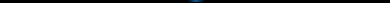

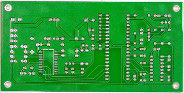

Fig. 1. Framework of YOLO-HMC.

of multiple defects in a tight and complex background needs to be further improved, and the above-mentioned methods do not achieve good performance synchronization and performance balance between detection accuracy, speed, and model size. To address the above problems, this article proposes a PCB tiny-size defect detection algorithm framework YOLO-HMC, which can quickly and accurately complete the extraction of small defect features in a PCB complex background with fewer parameters.

Especially, although the latest YOLO series model YOLOv8 [25] was published and it has a certain degree of improve- ment in average detection accuracy and speed compared with YOLOVv5, it has increased in network model parameters (the parameter number of YOLOv5 model is about 7.03 million, while that of YOLOv8 is about 30.07 million). Besides, the YOLOVv5S algorithm finds extensive application in the realm of surface defect identification, including several industries like as steel [26], fruits [27], and pipeline internal welds [28]. The algorithm’s efficacy and performance have been thoroughly verified. Therefore, to facilitate the deployment of the model on devices that do not support GPU, this article selects the mature YOLOVS as the basic framework.

backbone part for feature extraction, the neck part for feature fusion and the DH part for final recognition results.

Due to a large number of tiny-sized pads, vias and dense traces are distributed on the PCB substrate; this causes some interference with the accurate extraction of key defect features of the model. This problem is often solved by improving the channel and spatial attention of the network model, Zheng et al. [29] added the coordinate attention (CoordAtt) module and the HorBlock module to the network to enhance the effective features of the feature extraction process in the channel domain and the spatial domain, weaken the invalid features, and realize the complex background. Based on the YOLOv7 architecture, Chen et al. [30] generated spatial and frequency domain features through the global filtering of HorBlock, which improved the accuracy of the algorithm on the leather defect dataset. In this article, the recursive gated convolutions structure of the C3HB module [31] is used to enhance the explicit spatial interaction before and after feature region extraction, so that the extracted feature information contains richer semantic information and the anti-interference ability of the network model in complex PCB background is enhanced.

# II. METHODOLOGY

The YOLOVS has gained considerable popularity in various object detection tasks. But compared with the natural detection task that contains a variety of size detection targets, the tiny- size defects in the PCB detection task are far smaller than other size defects [1]. The color and shape of the defect image and the defect-free image are hard to distinguish, which leads to a high rate of false positives and missed detection in the process of product quality inspection [6]. Consequently, it is necessary to further improve the detection accuracy and speed of YOLOvS based on the actual industrial quality inspection requirements of PCB manufacturing.

# A. Overall Framework of YOLO-HMC

As shown in Fig. 1, we design a novel YOLO-HMC framework based on improved YOLOVS, which consists of the Authorized licensed use limited to: Texas A M University. Downloaded

on

In the neck park of YOLOvS, the original model cannot realize the fast and accurate positioning of the defect object in the complex background of PCB, where defects only occupy a small area of the circuit board and are difficult to capture quickly. Hence, the CBAM attention mechanism [32] was introduced by some scholars before the feature processing to highlight the defective feature information. Chen and Dang [33] combined the CBAM attention mechanism with a feature fusion module to enable the model to selectively focus on relevant feature channels and spatial positions, thereby enhancing the discriminative ability of feature representation. However, the current CBAM module frequently only provides feedback for the eigenvalues that have the largest response across the whole feature region, which makes it unable to simultaneously meet the requirements for the detection of multiple tiny defect targets with similar features in the PCB defect detection process. Consequently, the CBAM needs to April 13,2025 at 14:06:23 UTC from IEEE Xplore. Restrictions apply.

## 2001611

## IEEE TRANSACTIONS ON INSTRUMENTATION AND MEASUREMENT, VOL. 73, 2024

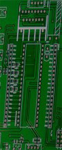

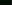

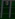

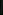

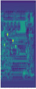

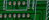

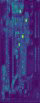

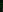

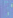

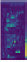

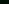

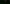

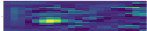

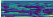

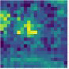

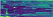

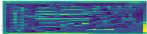

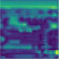

Fig. 2. Schematic of image down-sampling process.

be improved adaptively to enhance the detection performance for multi-target issues.

Through multiple up-sampling, down-sampling, and convo- lution operations, the neck part fuses the location information of shallow features and the semantic information of deep features, which increases the overall receptive field and obtains richer feature expression. However, the up-sampling module in the original model has a weak ability to expand feature information, and it is easy to lose deep feature information in this process. To address this issue, using the CARAFE module [34], Yang et al. [6] integrated context semantic infor- mation in the large receptive field and integrated additional large detection layers to enhance the detection of small targets. Liu et al. [35] used PVT v2B2-Hi as the backbone network and used the CARAFE up-sampling module to enrich the semantic features of defect targets to improve the algorithm’s ability to discriminate PCB defects. Hence, we introduce the CARAFE module that can output the corresponding up- sampling feature map according to the input feature to reduce the loss of information and optimize the network feature processing results.

In the head part of the original model, three DHs with different down-sampling multiples are designed to detect large, medium, and small targets, respectively. In contrast to the natural detection task, PCB defect detection primarily targets a high number of tiny-size targets. The large and medium-sized object DHs in YOLOv5 will over-compress these small defect targets, resulting in the loss of feature information of the defect target in the feature extraction process, which brings a negative impact on detection accuracy. Therefore, this article retains a small target DH that is more suitable for detecting tiny defects, and abandons other DHs and corresponding feature processing structures.

Fig. 3. Basic process of HorNet.

network model, the size of the convolution kernels in the feature extraction structure will not change significantly, which leads to the convolution kernel bringing a larger area of defect- free structures around the defect structure into the convolution calculation process. These defect-free structures are similar to the defect structure and densely arranged, seriously interfering with the feature extraction results of convolutional networks.

To address this problem, we introduce the C3HB module to enhance the feature extraction ability of the model. Compared with the C3 module, the C3HB adds the HorNet structure. The main structure of HorNet is the lightweight convolution operation depthwise separable convolution (DWConv), which requires only a third of the traditional convolution to achieve the same effect as the traditional convolution [31]. As shown in Fig. 3, when the input feature Po enters HorNet, the dimensionality is first increased through convolution, and it is divided into two sets of feature maps P, and Qo according to a predetermined proportion. After passing through the DWConv structure, Qo outputs multiple sets of sub-feature maps Q;(1 < i <a). Afterward, P; and Q, perform dot product operation and increase the dimension through convolution to obtain P). Repeat the iterative process until the last sub-feature map Qy. Through the above multiple information interactions, the Hor- Net connects feature information by generating self-weighted parameters, so that the network model obtains high-order deep features with stronger semantic information, which effectively improves the resolution of the network.

# B. Description of the Improvements

Assuming that input x ¢ R?*"*C, the HorNet process can be expressed as the following equation:

1) HorNet-Based Feature Extraction Method: In the PCB defect detection process, there are a large number of defect- free elements and the detection target area has a low degree of discrimination from the substrate background, which will cause serious interference to the extracted feature information, and thus seriously affect the defect feature extraction effect.

Po = f (x) dd)

Cc Co= Fant (2)

(Qo) = [ HxWxCo HW2Cy_ coy Bowe) @B)

As shown in Fig. 2, the various components in the detection image exhibit a dense and compact arrangement. In the process of extracting deep information from detection images, the channel dimension (C) will deepen and the height and width (H x W) of feature maps will be compressed. At the same time, to ensure the stability of the receptive field of the

HxWxCo _ p=}'o i= (4) f(Pi-19 Qi-1), 1 >2

where the function f represents convolution operation, the function g represents depthwise separable convolution, and a represents the spatial order set during the HorNet process.

Authorized licensed use limited to: Texas A M University. Downloaded on April 13,2025 at 14:06:23 UTC from IEEE Xplore. Restrictions apply.

## YUAN et al.: YOLO-HMC: AN IMPROVED METHOD FOR PCB SURFACE DEFECT DETECTION

## 2001611

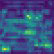

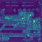

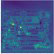

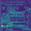

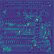

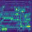

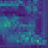

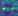

Fig. 4. Basic process of MCBAM when the 7 is set to 3.

Fig. 5. Diagram of CARAFE structure.

TABLE I

2) CBAM-Based Attention Mechanism: Due to the difficulty in distinguishing between background and defect areas in PCB, rapid defect detection has become a challenging task for detection models. In light of this, the present study incor- porates the CBAM module into the backbone layer to enhance the model’s attention toward critical regions. As shown in Fig. 4, compared with traditional attention mechanisms such as SENet [36] that only focus on features on channels, CBAM combines both spatial and channel levels, and effectively improves the detection performance of various models through dual attention.

DISTRIBUTION OF SMALL TARGETS IN THE DATASET

Defect Classification| Number| Area(pix)| <32?  
---|---|---|---  
Image| Instance| <10?| <16?  
Missing_hole| 690| 2889| 2| 962| 1875  
Open_circuit| 690| 2804| 380| 1740| 682  
Mouse bite| 696| 2886| 92| | 1255-1508  
Short| 696| 2868| 11| 384| 2209  
Spur| 690| 2863| 36| 672| 2095  
Spurious copper| 696| 2947| 10| 485| 2389

It is worth noting that CBAM mainly emphasizes the impact of the maximum response value of the entire image on the model, while the actual detection process usually involves the recognition of multiple targets. If not improved, it is easy to miss some defects. Therefore, this article proposes a MCBAM to address this issue, as shown in Fig. 4. First, MCBAM will divide the input image into n x n subspace matrices in different spaces, where n is the average number of defects of each type. The relevant calculation is shown in (5). Second, the maximum response value in the subspace is extracted once to ensure that defects in the subspace can be quickly noticed by the model in this form. Then, the spatial information of the feature map is aggregated through two average pooling layers. The channel attention mechanism compresses the spatial dimension of the input feature map through a shared fully connected layer, sums up each element, and normalizes it to generate a channel attention map.

pixels. In this process, the adjacent regions are easy to become blurred between each other, especially when the pixel values of adjacent pixels are close, and the color block phenomenon is easy to occur. Defects such as residual copper and short circuits are shown as fine green stripes on the image, and the circuit structure around the defect is very close to its color and shape.

As shown in Fig. 5, the structure of CARAFE is divided into two modules: up-sampling kernel prediction and feature reconstruction. Compared with the nearest method of up- sampling, CARAFE designs a matching up-sampling kernel according to the input features and then performs feature recombination based on the predicted up-sampling kernel. CARAFE has a larger range of receptive fields. In the face of intensive detection tasks such as PCB defect detection, it can aggregate global features through context and output up-sampling results that are more conducive to detection.

The calculation for n is as (5), where 4 represents the number of defect types, x;; represents the number of defects in the jth image sample of the ith defect, and m; represents the total number of image samples of the ith defect

_ Li- jan xij = x . Diam n (5)

3) Up-Sampling Method—CARAFE: Up-sampling is one of the widely used methods in neural networks, including linear interpolation up-sampling, transposed convolution based on DL, and up-sampling methods. YOLOvS5 adopts the nearest method of up-sampling. The original up-sampling method only considers the nearest pixels, ignoring the information of other adjacent pixels and the smooth relationship between

4) Optimization Method of DH for Tiny PCB Defect: There are two main methods to define small targets in the existing research. One is the object with a relatively small physical size in the real world, and the other is the object occupying a size below 32 x 32 pixels [37]. According to [38], there are a large number of small targets in the PCB dataset, even smaller than 10 x 10 pixels, as shown in Table I. These defect targets will lose information in the process of continuous feature extraction because of their small size when performing defect detection tasks.

The detection component of YOLOvS includes three DHs that are eight times, 16 times, and 32 times down-sampling, which correspond to the detection of small, medium, and large target objects, respectively. The three DHs can simultaneously ensure the detection effect of YOLOvS5 on target objects of

Authorized licensed use limited to: Texas A M University. Downloaded on April 13,2025 at 14:06:23 UTC from IEEE Xplore. Restrictions apply.

## 2001611

## IEEE TRANSACTIONS ON INSTRUMENTATION AND MEASUREMENT, VOL. 73, 2024

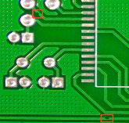

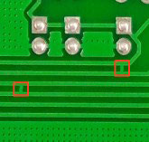

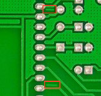

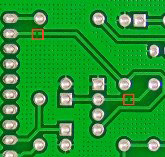

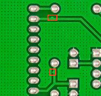

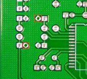

Fig. 7. HRIPCB dataset defect diagram: (a) missing_hole; (b) open_circuit; (c) spur; (d) short; (e) spurious copper; and (f) mouse bite.

Fig. 6. Comparison of experimental results obtained using different DH combinations.

different scales. However, in the PCB defect detection task, most defects have a small proportion in the overall image. For instance, when the input image size is 640 x 640, the image is compressed to a mere 20 x 20 after passing through the 32 times down-sampling DH. This reduction in size causes the small and medium defect targets to shrink significantly, possibly becoming smaller than a single pixel. In the process of feature extraction, the semantic information and position information of the small and medium defect target will also be lost with compression. Therefore, using the DH of the original model is not conducive to the detection of small objects.

To validate the aforementioned hypothesis, a series of comparative experiments are conducted, as illustrated in Fig. 6. The results show that when using YOLOv5S to realize PCB defect detection, only retaining the small object DH can ensure the detection accuracy while compressing the number of model parameters, indicating that the large object DH will seriously lose favorable information and reduce the detection accuracy, and the mixed-use of medium and small DHs will also affect detection accuracy each other in the PCB defect detection scene. Therefore, this article removes the medium and large object DHs and their corresponding feature pyramid structure. In Section IV-C, we provided a further detailed description of the results.

in the first three epochs, and the learning rate was dynamically adjusted by linear interpolation. After that, the learning rate is adjusted to 20% of the original by every ten epochs, a 0.0005 weight decay, and a 0.949 momentum were used [37].

2) Dataset: As shown in Fig. 7, the dataset used in the experiment is the public dataset HRIPCB [40] released by Peking University, which contains 693 images and six defects with an average pixel size of 2777 x 2188 pixels. The division ratio of the training set and the test set in this experiment is 9:1.

3) Evaluation Indicators: The model performance indica- tors commonly used in the object detection task include recall, precision, average precision (AP), and mean average precision (mAP). Recall refers to the proportion of the actual number of positive samples in all the targets detected as positive samples. Precision refers to the proportion of the number of positive samples detected in all actual positive samples. The two indicators often interact with each other. When recall is high, it will lead to a decrease in precision and false detection. However, when precision is high, it will lead to a decrease in recall and missed detection. The calculation formulas of recall, precision, AP, and mAP are as follows:

T, Recall = 6 eca Tr (6)

Precision = ———— (7) Tp + Fp

# IV. EXPERIMENT AND RESULTS

A. Design of Experiments

1 AP = [ P(r)dr (8)

1) Experimental Environment and Training Strategy for Model: The hardware equipment used in this experiment is Intel! Core? i5-10200H CPU @ 2.40 GHz, memory 16 GB, NVIDIA GeForce GTX 1650 Ti, video memory 4 GB, and DL framework selects pytorch. In the experiment, the size of the input image is set to 640 x 640. Adam is selected as the optimizer, the initial learning rate is set to 0.01, and the batch_size is selected as six considering the memory size of the hardware device.

- , AP = AP; 9 m n+1 >» )

where Tp is true positive; Fp is false positive; Fy is false negative. P(r) represents the function image surrounded by recall and precision, and n represents the number of defect categories. Recall and precision obtained by each detection are combined according to the relationship to obtain the P—R curve, and the AP is calculated by interpolation method.

In the training process, the official pretraining weight file is loaded, and the automatic mixing accuracy method is used for training. This method can effectively reduce memory usage and speed up the training. Preheating training was carried out

‘Registered trademark. ?Trademarked.

# B. Results and Analysis

The model is trained on the HRIPCB dataset, and the results are shown in Fig. 8. The experiment shows that the model has completed convergence within 100 epochs, so this article sets the training period to 100. It can be observed

Authorized licensed use limited to: Texas A M University. Downloaded on April 13,2025 at 14:06:23 UTC from IEEE Xplore. Restrictions apply.

## YUAN et al.: YOLO-HMC: AN IMPROVED METHOD FOR PCB SURFACE DEFECT DETECTION

## 2001611

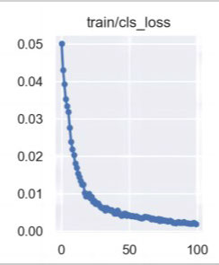

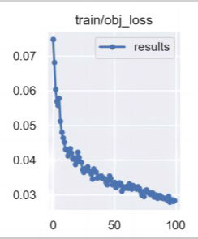

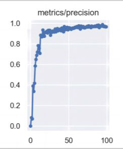

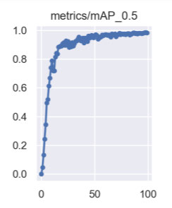

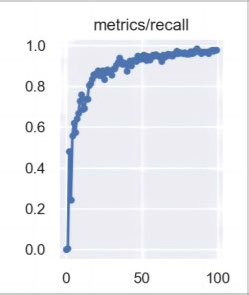

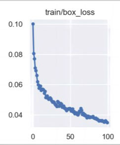

Fig. 8. Model training results. (a)-(c) Change in loss values during the training process. (d) and (e) Recall and accuracy of the model. (f) Accuracy of the model.

TABLE II

SPECIFIC VALUE OF DEFECT MAP

Defect Classification| mAPos (%)| mAPo.5:0.95 (Y)  
---|---|---  
Missing_hole| 99.5| 64.6  
Open_circuit| 98.1| 56.5  
Spur| 97.9| 43.9  
Short| 99.0| 58.8  
Spurious_copper| 98.9| 53.0  
Mouse bite| 97.6| 52.4

# TABLE III

PERFORMANCE COMPARISON TABLE OF MODEL TEST RESULTS

both Faster R-CNN and YOLOv8 have serious false detection problems. Many defect-free structures are identified as defects, while YOLOv7 has the problem of missing detection, such as the lack of complete detection of defects in spur, spurious copper, and short. Compared with other detection models, YOLO-HMC has no false detection and the number of defects detected is the most complete. At the same time, the model parameters are compressed to a certain extent, and the con- vergence speed is faster in the training process, which is more conducive to the storage and calculation of the PCB defect detection process on embedded devices, and the detection accuracy is higher.

Method| Parameters (Million)| mAPos (%)| mAPo5s:095 (%)| Inference time(ms)  
---|---|---|---|---  
Faster R-CNN| 23.59| 86.8| 39.3| 96.8  
ssp| 26.29| 52.5| 21.4| 90.1  
YOLOvS| 7.03| 92.5| 44.1| 52.0  
YOLOvé6 !#!| 17.2| 90.4| 43.2| 45.1  
YOLOv7 [31| 37.22| 95.5| 50.3| 45.3  
YOLOvs “41| 30.07| 90.3| 45.2| 73.5  
YOLO-MBBi 1| 8.8| 96.7| 52.5| 79.2  
GCC-YOLO 81| 8.2| 97.1| 48.5| 70.2  
Light-PDD ""]| 3.84| 93.8| 47.1| 109.2  
YOLO-HMC| 5.94| 98.6| 54.9| 44.6

from the results that the loss values of each item decrease rapidly in the first 50 epochs. The loss values of the training set and the verification set in the same category have little difference and the trend is consistent. The loss values decrease steadily, and precision, recall, and mAP_0.5 tend to converge between 50 and 100 epochs. Finally, the model achieves a better training effect and completes the convergence.

It can be seen from Table II that the detection accuracy of larger defect types such as missing_hole, short can reach more than 99%, and the detection accuracy of smaller defect types such as mouse bite, spur, and open_circuit can reach more than 97.5%.

In addition, to verify the superiority of our model, we com- pared the detection performance with other state-of-the-art models in the same experimental environment as the above experiments. The comparison results are shown in Table III and Fig. 9. Considering the poor performance of the SSD model during training, we did not use it for comparison.

It can be seen that compared with other algorithms such as YOLOv8, the proposed algorithm in this article has signifi- cantly improved performance indicators such as mAPo5 and mAP»,5.0.95. AS shown in Fig. 9, Faster R-CNN, YOLOv7, and YOLOv8 have better detection effects on various defects, but

# C. Ablation Studies

To verify the improvement of model performance by struc- tures such as HorNet, CARAFE, and MCBAM, an array ablation study was performed on the YOLO-HMC in this experiment. First, we optimized the DH structure for small object detection, and in subsequent experiments, we also started from this foundation. Then add HorNet, CARAFE, and MCBAM in sequence to verify whether they contribute to the detection results. Finally, we add these improved structures in pairs and check if there is any problem of damaging each other between them. The experimental results are shown in Table IV.

From Table IV, it can be seen that after optimizing the DH, mAPo,5 increased by 3.5%. Other improvement methods also achieved varying degrees of improvement compared to Baseline, and there was no conflict between them. To further verify the effectiveness of the methods proposed in this article, we have conducted corresponding analyses and proof for each improved method.

1) Detection Head: This section will provide further sup- plementary explanations for the experiment in the third section. We designed multiple comparative experiments, such as not modifying the number of DHs, removing small object DHs separately, or retaining only small object DHs, to verify the impact of different sizes of DHs on PCB surface defect detection. It can be seen from Table V that large object DHs exhibit larger volume defects such as missing_holes and others have a certain detection effect, but the detection effect is not good on small volume defects, and when combined with other DHs, it will affect the final detection effect. We found that retaining only small object DHs can achieve higher detection accuracy of the detection model, while medium-sized object

Authorized licensed use limited to: Texas A M University. Downloaded on April 13,2025 at 14:06:23 UTC from IEEE Xplore. Restrictions apply.

## 2001611

## IEEE TRANSACTIONS ON INSTRUMENTATION AND MEASUREMENT, VOL. 73, 2024

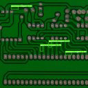

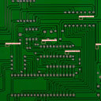

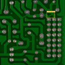

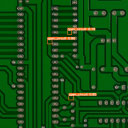

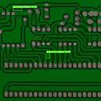

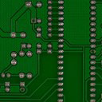

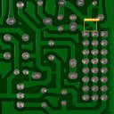

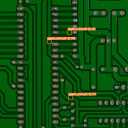

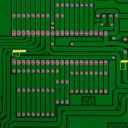

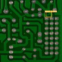

Fig. 9. Detection effect on different models.

TABLE IV

ABLATION EXPERIMENTAL RESULTS,

Methods| Detection head (DH)| MCBAM| CARAFE| HorNet| =mAPo3s(%)|
mAPo.5:0.95(%)  
---|---|---|---|---|---|---  
YOLOv5| | | | | 92.5| 44.1  
YOLOv5+DH| V| | | | 96.0| 51.9  
YOLOv5+DH+MCBAM| Vv| Vv| | | 96.9| 54.7  
YOLOv5+DH+CARAFE| Vv| | V| | 96.5| 53.2  
YOLOv5+DH+HorNet| Vv| | | V| 96.3| 52.3  
YOLOv5+DH+MCBAM+CARAFE| Vv| V| V| | 98.1| 53.0  
YOLOv5+DH+MCBAM+HorNet| Vv| V| | V| 97.9| 53.6  
YOLOv5+DH+CARAFE+HorNet| V| | V| V| 97.8| 53.7  
YOLOv5+DH+MCBAM+CARAFE+HorNet| v| v| y| y| 98.6| 54.9

TABLE V

RESULTS OF DIFFERENT COMBINATIONS

Different combinations| mAP for different types of defects (%)  
---|---  
Missing_hole| Open circuit| Spur| Short| Spurious copper| Mouse bite  
Large + Medium + Small| 99.5| 93.2| 91.6| 91.2| 90.3| 91.2  
Large + Medium| 99.5| 96.2| 90.1| 93.9| 93.5| 94.2  
Medium + Small| 99.5| 98.3| 91.5| 93.1| 91.8| 94.1  
Large + Small| 99.5| 92.2| 84.5| 93.2| 94.0| 90.6  
Small| 99.5| 99.3| 97.2| 96.1| 97.1| 95.4  
Medium| 99.5| 98.5| 93.5| 93.6| 95.8| 94.4  
Large| 99.5| 43.7| 36.4| 57.6| 48.2| 45.8

DHs do not achieve this effect on small volume defects. This experiment shows that in small object detection tasks, due to high down-sampling times, both medium and large object DHs will lose various types of information about the detected target to varying degrees. Therefore, this article removed the DHs for medium and large objects and their corresponding feature pyramid structures to ensure that the accuracy of the model can be improved.

2) HorNet: In this section, we conduct further experimental analysis using the original model and the model with HorNet added Fig. 10, respectively representing the visualization results obtained from the original model and the addition of HorNet structure, with brighter areas indicating more attention from the model. In the results, we use “True” to indicate that the model can accurately express defect information. From Fig. 10, it can be seen that in the early stage of training, only

Authorized licensed use limited to: Texas A M University. Downloaded on April 13,2025 at 14:06:23 UTC from IEEE Xplore. Restrictions apply.

## YUAN et al.: YOLO-HMC: AN IMPROVED METHOD FOR PCB SURFACE DEFECT DETECTION

## 2001611

Missing_hole

Spurious copper

Short

(a)

Fig. 11. Class activation map obtained before and after adding the MCBAM.

Input Image

10 epoch

20" epoch

Fig. 12. Different final feature extraction results were obtained using nearest neighbor interpolation and CARAFE methods.

Fig. 10. Visual results of the extracted features are used in the process of network training. (a) Original network model. (b) Model after adding the HorNet structure.

generated heatmap, it can be seen that the focus of the model deviates significantly from the defect position (open_circuit), and even is completely incorrect (short). After adding the MCBAM, this situation has been greatly improved.

some defects can be accurately expressed, and on the contrary, more defect-free features are emphasized. Excessive incorrect expression can even seriously affect the feature extraction results of subsequent training.

The feature information extracted through the Hornet net- work can effectively extract the features of defect structures, ensuring the reliability of feature extraction. The HorNet structure enhances the model’s anti-interference ability for dense layout problems.

3) MCBAM: To verify the effectiveness of the method used, we used the class activation mapping (CAM) [45] tool to conduct experimental analysis on different types of defects based on the original model and the model added with MCBAM. CAM is a tool that helps neural networks visualize, and through the heat map generated by CAM, we can observe which region the network is more inclined toward.

4) CARAFE: To demonstrate the effectiveness and gen- eralization of the improved method, we designed multiple comparative experiments for different types of defects. Consid- ering that the up-sampling structure occurs during the feature extraction process, we have listed the visualization results of each defect in the first and last layers of convolution. The difference is that the visualization results of the last layer of convolution are related to the up-sampling method used.

As shown in Fig. 12, using the nearest neighbor interpo- lation method, the visualization result of the last layer of convolution is relatively blurry and the defect information is not well expressed. The model cannot fully transmit the defect information to the final DH; On the contrary, the feature maps obtained using the CARAFE structure have clearer contours and more distinct boundaries, showing good performance on multiple defect types.

According to Fig. 11, when detecting defects with larger shapes such as missing_hole, the original model can effectively separate the background and defects. However, when detecting defects with smaller shapes, it is difficult for the original model to distinguish between the background and defects. From the

The above experiments show that HorNet and other struc- tures have improved the detection accuracy of PCB defect detection, which can make the YOLOVS algorithm have better performance and improve the detection accuracy of PCB defect detection.

Authorized licensed use limited to: Texas A M University. Downloaded on April 13,2025 at 14:06:23 UTC from IEEE Xplore. Restrictions apply.

## 2001611

IEEE TRANSACTIONS ON INSTRUMENTATION AND MEASUREMENT, VOL. 73, 2024

# V. CONCLUSION

In this article, a novel YOLO-HMC framework based on improved YOLOvS5S for PCB defect detection was pro- posed. The HorNet structure was introduced to enhance the tiny-size defects’ feature extract ability under the complex background of PCB. An improved MCBAM is designed to enhance the positioning ability of the model for multiple PCB defect targets. Then, CARAFE was used to replace the up-sampling layer to further accelerate the convergence of the model. Moreover, aiming at the problem of small object detection in PCB defect detection, the structure of the DH was adaptively optimized to improve the detection accuracy for tiny-size defects with fewer parameters of the network model. Compared with the current typical object detection model and the cutting-edge PCB defect detection model, the defect detection algorithm proposed in this article shows more excellent detection performance in the real-time PCB defect detection process.

12 Q. Yang and Z. Y. Li, “Software design for PCB defects detection system based on AOI technology,” Inf. Int. Interdiscipl. J., vol. 14, no. 12, pp. 4041-4046, Dec. 2011.

13 W. Jiang, T. Li, S. Zhang, W. Chen, and J. Yang, “PCB defects target detection combining multi-scale and attention mechanism,” Eng. Appl. Artif. Intell., vol. 123, Aug. 2023, Art. no. 106359, doi: 10.1016/j.engappai.2023.106359.

14 J. Ma and X. Cheng, “Fast segmentation algorithm of PCB image using 2D OTSU improved by adaptive genetic algorithm and integral image,” J. Real-Time Image Process., vol. 20, no. 1, p. 10, Feb. 2023, doi: 10.1007/s11554-023-01272-0.

15 H. Shekhar, M. Jagadish, S. M. Fahanus, and T. S. Kumar, “Image processing techniques for PCB board fault analysis with object extrac- tion and measurements,” in Soft Computing for Security Applications, G. Ranganathan, X. Fernando, and S. Piramuthu, Eds. Singapore: Springer, 2023, pp. 3140, doi: 10.1007/978-98 1-19-3590-9_3.

16 R. Ding, L. Dai, G. Li, and H. Liu, “TDD-Net: A tiny defect detection network for printed circuit boards,” CAAI Trans. Intell. Technol., vol. 4, no. 2, pp. 110-116, Jun. 2019, doi: 10.1049/trit.2019.0019.

17 H. Zhang, L. Jiang, and C. Li, “CS-ResNet: Cost-sensitive residual convolutional neural network for PCB cosmetic defect detection,” Expert Syst. Appl., vol. 185, Dec. 2021, Art. no. 115673, doi: 10.1016/j.eswa.2021.115673.

Although the YOLO-HMC proposed in this article can improve the detection performance to a certain extent, it is only verified by experiments on public datasets and the model must be trained with a large number of labeled samples. Therefore, in the ensuing study, we will further use a few defect samples collected on-site to improve the application of the model based on the idea of few-shot learning, to further improve its practicability and effectiveness in the actual environment of industrial inspection.

18 G. Ran, X. Lei, D. Li, and Z. Guo, “Research on PCB defect detection using deep convolutional nerual network,” in Proc. 5th Int. Conf. Mech., Control Comput. Eng. (ICMCCE), Dec. 2020, pp. 1310-1314, doi: 10.1109/ICMCCES 1767.2020.00287.

19 J. Redmon, S. Divvala, R. Girshick, and A. Farhadi, “You only look once: Unified, real-time object detection,” in Proc. IEEE Conf. Comput. Vis. Pattern Recognit., Jun. 2016, pp. 779-788.

20) W. Xuan, G. Jian-She, H. Bo-Jie, W. Zong-Shan, D. Hong-Wei, and W. Jie, “A lightweight modified YOLOX network using coordi- nate attention mechanism for PCB surface defect detection,’ JEEE Sensors J., vol. 22, no. 21, pp. 20910-20920, Nov. 2022, doi: 10.1109/JSEN.2022.3208580.

# REFERENCES

21 X. Liu et al., “Gaussian-IoU loss: Better learning for bounding box regression on PCB component detection,” Expert Syst. Appl., vol. 190, Mar. 2022, Art. no. 116178, doi: 10.1016/j.eswa.2021.116178.

J. Tang, Z. Wang, H. Zhang, H. Li, P. Wu, and N. Zeng, “A lightweight surface defect detection framework combined with dual- domain attention mechanism,” Expert Syst. Appl., vol. 238, Mar. 2024, Art. no. 121726, doi: 10.1016/j.eswa.2023.121726.

Y. Zhou, M. Yuan, J. Zhang, G. Ding, and S. Qin, “Review of vision- based defect detection research and its perspectives for printed circuit board,” J. Manuf. Syst., vol. 70, pp. 557-578, Oct. 2023.

F. Wang et al., “Laser-induced thermography: An effective detection approach for multiple-type defects of printed circuit boards (PCBs) multilayer complex structure,” Measurement, vol. 206, Jan. 2023, Art. no. 112307.

F. Yao, Y. Ding, S. Hong, and S.-H. Yang, “A survey on evolved LoRa- based communication technologies for emerging Internet of Things applications,” Int. J. Netw. Dyn. Intell., vol. 1, no. 1, pp. 4-19, Dec. 2022, doi: 10.5394 1/ijndi0101002.

22 J. Tang, S. Liu, D. Zhao, L. Tang, W. Zou, and B. Zheng, “PCB- YOLO: An improved detection algorithm of PCB surface defects based on YOLOVvS,” Sustainability, vol. 15, no. 7, Mar. 2023, Art. no. 5963.

23 Q. Zhao, T. Ji, S. Liang, and W. Yu, “PCB surface defect fast detection method based on attention and multi-source fusion,” Multimedia Tools Appl., vol. 83, no. 2, pp. 5451-5472, Jun. 2023.

24) B. Du, F. Wan, G. Lei, L. Xu, C. Xu, and Y. Xiong, “YOLO-MBBi: PCB surface defect detection method based on enhanced YOLOVS,” Electronics, vol. 12, no. 13, p. 2821, Jun. 2023, doi: 10.3390/electron- ics12132821.

25 Y. Zhang, H. Zhang, Q. Huang, Y. Han, and M. Zhao, “DsP-YOLO: An anchor-free network with DsPAN for small object detection of mul- tiscale defects,” Expert Syst. Appl., vol. 241, May 2024, Art. no. 122669, doi: 10.1016/j.eswa.2023.122669.

G. Ustabas Kaya, “Development of hybrid optical sensor based on deep learning to detect and classify the micro-size defects in printed circuit board,” Measurement, vol. 206, Jan. 2023, Art. no. 112247.

26 D. Xiao, FT. Xie, Y. Gao, Z. N. Li, and H. FE Xie, “A detection method of spangle defects on zinc-coated steel surfaces based on improved YOLO-v5,” Int. J. Adv. Manuf. Technol., vol. 128, nos. 1-2, pp. 937-951, Sep. 2023, doi: 10.1007/s00170-023-11963-4.

J. Yang, Z. Liu, W. Du, and S. Zhang, “A PCB defect detector based on coordinate feature refinement,” JEEE Trans. Instrum. Meas., vol. 72, 2023, Art. no. 5029410, doi: 10.1109/TIM.2023.3322483.

X. Tao, L. Peng, Y. Tao, and C. Ye, “Inspection of defects in weld using differential array ECT probe and deep learning algorithm,” JEEE Trans. Instrum. Meas., vol. 70, pp. 1-9, 2021.

B. Hu and J. Wang, “Detection of PCB surface defects with improved faster-RCNN and feature pyramid network,” JEEE Access, vol. 8, pp. 108335-108345, 2020.

27 Z. Wang, L. Jin, S. Wang, and H. Xu, “Apple stem/calyx real-time recog- nition using YOLO-vS5 algorithm for fruit automatic loading system,” Postharvest Biol. Technol., vol. 185, Mar. 2022, Art. no. 111808, doi: 10.1016/j.postharvbio.2021.111808.

28 L. Xu, S. Dong, H. Wei, Q. Ren, J. Huang, and J. Liu, “Defect signal intelligent recognition of weld radiographs based on YOLO V5-IMPROVEMENT,” J. Manuf. Processes, vol. 99, pp. 373-381, Aug. 2023, doi: 10.1016/j.jmapro.2023.05.058.

G. Liu and H. Wen, “Printed circuit board defect detection based on MobileNet-YOLO-Fast,” J. Electron. Imag., vol. 30, no. 4, Jul. 2021, Art. no. 043004.

29 J. Zheng, H. Wu, H. Zhang, Z. Wang, and W. Xu, “Insulator-defect detection algorithm based on improved YOLOv/7,” Sensors, vol. 22, no. 22, Nov. 2022, Art. no. 8801, doi: 10.3390/s22228801.

[10 Y.-T. Li, P. Kuo, and J.-I. Guo, “Automatic industry PCB board DIP process defect detection system based on deep ensemble self-adaption method,” JEEE Trans. Compon., Packag., Manuf. Technol., vol. 11, no. 2, pp. 312-323, Feb. 2021.

30) M. Chen, J. Gao, W. Yu, and H. Peng, “LD2-YOLO: A defect detection method for automotive composite leather,’ in Proc. Int. Joint Conf: Neural Netw. (IJCNN), Broadbeach, QLD, Australia, Jun. 2023, pp. 1-8, doi: 10.1109/ijenn54540.2023.10191146.

( F. Raihan and W. Ce, “PCB defect detection USING OPENCV with image subtraction method,” in Proc. Int. Conf. Inf. Manage. Technol. (ICIMTech), Nov. 2017, pp. 204-209.

31 Y. Rao, W. Zhao, Y. Tang, J. Zhou, S.-N. Lim, and J. Lu, “HorNet: Effi- cient high-order spatial interactions with recursive gated convolutions,” 2022, arXiv:2207. 14284.

Authorized licensed use limited to: Texas A M University. Downloaded on April 13,2025 at 14:06:23 UTC from IEEE Xplore. Restrictions apply.

## YUAN et al.: YOLO-HMC: AN IMPROVED METHOD FOR PCB SURFACE DEFECT DETECTION

## 2001611

32 S. Woo, J. Park, J. Y. Lee, and I. S. Kweon, “CBAM: Convolutional block attention module,” in Proc. Eur. Conf. Comput. Vis. Cham, Switzerland: Springer, 2018, pp. 3-19.

33 B. Chen and Z. Dang, “Fast PCB defect detection method based on FasterNet backbone network and CBAM attention mechanism integrated with feature fusion module in improved YOLOv7,” IEEE Access, vol. 11, pp. 95092-95103, 2023, doi: 10.1109/access.2023.3311260.

34, C. L. Chen, D. Lin, J. Wang, K. Chen, R. Xu, and Z. Liu, “CARAFE: Content-aware reassembly of features,” 2019, arXiv:1905.02188.

a

Yongbing Zhou received the master’s degree in mechanical engineering from Southwest Jiaotong University, Chengdu, China, in 2022, where he is currently pursuing the Ph.D. degree in mechanical engineering.

His research interests include intelligent schedul- ing, machine vision, and deep learning.

35 Y. Liu, X. Liu, and B. Zhang, “RetinaNet-vline: A flexible small target detection algorithm for efficient aggregation of information,” Cluster Comput., pp. 1-3, Aug. 2023.

36 J. Hu, L. Shen, and G. Sun, “Squeeze-and-excitation networks,” in Proc. IEEE/CVF Conf. Comput. Vis. Pattern Recognit., Jun. 2018, pp. 7132-7141.

37 K. Tong, Y. Wu, and F. Zhou, “Recent advances in small object detection based on deep learning: A review,” Image Vis. Comput., vol. 97, May 2020, Art. no. 103910.

38 K. Xia et al., “Global contextual attention augmented YOLO with ConvMixer prediction heads for PCB surface defect detection,” Sci. Rep., vol. 13, no. 1, p. 9805, Jun. 2023.

Xiaoyu Ren received the bachelor’s degree from Huaqiao University, Xiamen, China, in 2022. She is currently pursuing the master’s degree with South- west Jiaotong University, Chengdu, China.

Her main research interests include intelligent scheduling and reinforcement learning.

39 H. Xin, Z. Chen, and B. Wang, “PCB electronic component defect detection method based on improved YOLOv4 algorithm,” J. Phys., Conf. Ser., vol. 1827, no. 1, Mar. 2021, Art. no. 012167.

40. W. Huang, P. Wei, M. Zhang, and H. Liu, “HRIPCB: A challenging dataset for PCB defects detection and classification,” J. Eng., vol. 2020, no. 13, pp. 303-309, Jul. 2020.

41 W. Liu etal, “SSD: Single arXiv:1512.02325. shot MultiBox detector,’ 2015,

42 C. Li et al., “YOLOv6: A single-stage object detection framework for industrial applications,” 2022, arXiv:2209.02976.

43 C.-Y. Wang, A. Bochkovskiy, and H.-Y.-M. Liao, “YOLOv7: Trainable bag-of-freebies sets new state-of-the-art for real-time object detectors,” in Proc. IEEE/CVF Conf. Comput. Vis. Pattern Recognit. (CVPR), Jun. 2023, pp. 7464-7475.

D. Reis, J. Kupec, J. Hong, and A. Daoudi, “Real-time flying object detection with YOLOv8,” 2023, arXiv:2305.09972.

45 B. Zhou, A. Khosla, A. Lapedriza, A. Oliva, and A. Torralba, “Learning deep features for discriminative localization,” in Proc. IEEE Conf. Comput. Vis. Pattern Recognit. (CVPR), Jun. 2016, pp. 2921-2929.

2.

Hui Zhi was born in Sichuan, China. He received the master’s degree in mechanical engineering from Tsinghua University, Beijing, China, in 2006.

He is currently a Senior Engineer at Sichuan Changhong Electrical Appliance Company Ltd., Mianyang, China. His research interests include intelligent manufacturing.

Jian Zhang was born in Sichuan, China, in 1972. She received the master’s and Ph.D. degrees in mechanical engineering from Southwest Jiaotong University, Chengdu, China, in 1997 and 2015, respectively.

She is currently a Professor with the Department of Manufacturing Engineering, School of Mechani- cal Engineering, Southwest Jiaotong University. Her research interests include intelligent manufacturing, production scheduling, machine vision, and surface defect inspection.

Minghao Yuan received the bachelor’s degree from the Hebei University of Technology, Tian- jin, China, in 2022. He is currently pursuing the master’s degree with Southwest Jiaotong University, Chengdu, China.

His main research interests include machine vision and defect identification.

Haojie Chen received the Ph.D. degree in mechan- ical manufacturing and automation from Southwest Jiaotong University, Chengdu, China, in 2022.

He is a Post-Doctoral Researcher with the Depart- ment of Industrial and Manufacturing Systems Engineering, State Key Laboratory of Digital Man- ufacturing Equipment and Technology, School of Mechanical Science and Engineering, Huazhong University of Science and Technology, Wuhan, China. His research interests include hyper-heuristic, shop scheduling, machine vision, and deep learning.

Authorized licensed use limited to: Texas A M University. Downloaded on April 13,2025 at 14:06:23 UTC from IEEE Xplore. Restrictions apply.
