# REF SINT BE RISCHE BS HM RO REO

# AEF SCA His HH 9 BS HH DH WB PET FE

ANBLMLAF ZA APR RIE

# wz

ESRKPER CARE, POKARARARDRKAZ) EBA A RHR RMT KE REDAARE, SRRUOEAARAR MAARBSRRA GREE EY ST REBFLAERRAAERE A.

ARR T-AETFRAMHARKEAREAARBRARER HAUT RBABBA PHAM BEAM A KE. CH AHAB AEN GER RBA BB ERR, HD KBB UT HK EZ FRTHMAFADHORA, ATAHRHREREAMAPASRBEDHR ET Hah. HA MT EFLARASBEABHAH AR PK BERPCEPREREP ORS ARHRT OSB WR KA RETPSRAROHAERE TK. BK ZFREKEHMKE, WAI KBAARKRARK DRATHARAEOH RAI PREHRARRENRRKARUR. Re HRA KH BR, SUTAFHRBEEHRS RR, AKRAREPRSNRATRALH BARTRAKAAA ROR HEE T RERE.

AFAR HKHRERASRSEKRGEAMEROAEARARTRAREM PERM PREA 4PRERERRATAFAAE AHTHRARKERR SAKK A SHRALAKRKHARKERK TIA AHKRA A

KAA: RARER RKRARRA MAMBEAM FRRB

# -31A

# (—) DEFEAT IR ARE L

SRR EAA CRT ARR PSE PR IS BEF 2019 FEAT Fe AC C5 TR ER SS) hn KTR RUM TORK ATT SAMREHMU. RARRLE-CA MG ROR, E—-AA GRAN TE BH , RAE ADL LAY Se EB Bh Hn Pe LH OB, SEN 5s TT LS PE HK EH FY RHE, DSR Ral RIL Te AE BCH OR SE HE A VG, FF A TE Ca A BAAR TS , Yo BR AR — BR TB PN AY) BE A eH TH TS BR ATT BH HER

(22581 FR El BE UL RE ) op HE HH YE LEB 2020 Foe AR EA BR tL Se EH ER ES , BI) 2035 AF BE Ap Sat aR CH BR EB, WA Be BY AR LSS AA RA 77 ER 9 CS, EE HAMM MBRAKRLRAREAKR RAARMRE. CAMS ERLE HARRSS TG Hei ‘FAO HE AL AA A EET AAI, SEU T AS BR AEE ET Ae ARS 20 5 A TR BE FRE , BOS AC A BCH PE HE Bh OS TT ORR ERA HM ART ME HCL ERY 6], BAERFAFHRRARNBD NFRALESMSEREM KR HAAFLSR RAABEAKEX.

BE ASC 5 Br HE WH EY Dh a RR ah AP YR, RO BE 3 eS AR SSE WP AE A AR SS GE , BE — A HG aN Ble A OO CT AS EC HS FE A AR RBI YE AALS AMY CHE , SCL a A HE 9 SB Ac SG» A TI BP FR BE BY HS TE A ete, Hf A FAS AC 9 KU C5 HE SS SB TA, BR a A BR BY RSE

ATHEISM EL -BY RE BC HG 9 BB BERR AG AR, EF Se ANT 3 ie BH SS HA a 2 a HE

3

SEMEL Dy the ARR WS TB AE ZEB A 9 HH He A a HE SET FEY SE HY PR 2S BR HE HOD LL PAL FF BT AA PY SB «Sk A WB 25 BA AR «TT SH FF 2 A RE OR A 4 HY BRE 5 RD 2 HAE «AA AE BC

AEE AY OL A HH HE EAB TB EA HE Bh A A 2 I, ET RS EE 5 2 SME HE , Be eS WR BA HN, $n BS a 2 a AA ATS Bt A Se 2 Oe A Bij AR A SR ys AS PE EE Oe hy TAS 2 BA SS PPB a A A 2 SA A S15 JB)» MEG ZS 3 CE OS BD AR FM

(=) mR RB

ARK UA MEF BeOS ES BH A 9 FA 5 WB tk ST Hy EE BA» OG BEF HES TA AiR RICA A PAT 1G BE HRRERASSMAMRRAR, AL ABSHAU FST MORK RI ME. 1. 8S FES

NSF iS) BE (a RE AD ARIMA" tS 28 Pd, ORL AD A I oD ETE OA 0) FEA BAY AT TB OY BR ey, SVM Ct — TR iy Se i BIG 0 MIRON, Jain AM HAGE 49 BS 0) PEW Py the 5 2 9 PR Hts AH GO A PE, A SE. Zhang FATA T HEM ERE 0 FETS P 9A RHE HEA FP SA RSP SD HEE (PY AT HS, PAST ARIMA Fi He AIR YAY FIV. Liv” Siami-Namini‘'? Sagheer“") a , BET RA LSTM Wie Met SE HE ME.

2. IRR

STS ZS Fh MR eR MBL ND 9 HEP EM of LE BMH — A AI A eS A AR HR 77 85) Bh HB FEO , FELL T AR I eA SRF PR RO EERO, Zhengeral. 38 i T MF MR F649 1E 9 Crucitti-Latora-Marchiori(CLM) (CM. 51 A HRMS ARM HHRMA FRM. OLRRRTLARGRRAR. Wang FAOMETAECRHHSAMG MMT Ri eaw LERRAOKE, CORY TRERN RA RARAAARGOKEGEASMY, SUI ACLA FG BRM Uy LOD WE BLS HT WL Pe A. A SU BO a 2 IR RAB T Bi VG £0 TL BE I 5 By « ALS HPD TE 3 el De ET 2 9 OR. 3. RBS

StH 20 FH. MH Mt — WIS ETM A. 1998 4E Warts TEC A HRA Lb WRT (Small World, 1999 4 Barabasi™ EC aL RMT (ScaleFree), LAH HS GEAR SASH KE FCBA DEF HHO HAF DOME? AR BAM, EER, GH OG EE RI EO. DBE EME: SO BO OO | Re OS HE NE AY OB HE OO SO a ik. ZEA EP EE EX Hy HS A fe FR PT PE TO EO. aE BY ERAN AT Ae TES?

OH ALLEL IE REAR HL Bhs Hy CORN) 09 He OAD A HE 2K 2b ESE BY 4 I. — a HARE URN WHIMA. TE URN FBC HERE My BR He Ee le) WR SE BR a a TOK RMR HRRMEM HH”, Bono M Gutierrez it xt MA Mi Hh Mie IS Wl 5} HF. Xt 2010 4F 566 56 HIE 60 SIE Bs VY GS EME TT TO ANTE. LH ETE A HG He a HE RY HS Hk Be 9 HE TPE SOG LE MARU OMG, FEA RARBG M4 OA Me A AE AE A OA HE A Ai URN ORB.

Fo SSE RAGE F 8 PT 5 (DMB A Se AY, A a A , EMMA ML MAN ME LG BAZ AEE. FR 185 Fl 05 2 A IE A A, SOM IRS «IE PE REA EW ERE AD Mp 2 JD ALIS BE FG Hes FENG UA A TN SLs FB 009 eS AAG a STS OY AA SA 9 8 SEAGIG AAG De « WS HAF MRA OY ERA HH A Gh He AN J a a «SE REABRERE, A ARIF LT URN GREMNP ORECRRARRRRROGU, He FAW HRI —TORM ABE BRAG MT AE AA, Wang FAC HT AS HADES Pe AE THER. Zeng AO? st it sMh Bh LE — Keb A Vt 10) By a Hak AFF

=a

(9) AE SCO OMT LK

ARYA TE HA ET — A AM Bt eS ARR A 0 2 As A HT REBUG OLE MRAM ANE I ST RN MR. EAR Hs TP AR EE FF BB IO ST He EES RT EE RAR. TTR SD AAA ET T OAD. MRT RABE FRA GAS MA RG LB.

RED He A EL T — BEDS Bh G9 2 hs CE te A A PT HH, TRA Hi APG ES BRA BB KE 9 SUL BS AOD SP I AA IL OO. ETT RRO, 2 A] RAT REO RR RIS RIM BTR EO ARETE MAM,

# = SAR

# (—) RG 2 is

ERB MMR RW HE5 HF T dO PEMS(Performance Measurement System)08 #M PEMS04 il Be SEC HE MS «RK A SH $e IE AG 9 HG BAR ANAT AS RH ATT ESE RE. RT TE ERR ERNMURBRINSH GHLFRS, 0 RASRAAASBRURHAH UREARMLE MRR # FURRAGARAESHPRLARAEEBR. UA HOSRAAMMRKE. RUTH AED ZB 6 RT 40 Bt 3 AE A 09 SE IR. Ae A 7 a BI SR CAE FE ECL IR TK ICME Me WR > T 308 RE HM Bh 28 SHR 9 S.A Be D5 BL fl] OORT LIE AR SEL TA FA GE Bh 09 Se 8 1G AR HE — SP HT.

BURABE MARE EAA MARMARA WF RR — PN EMI. MEM AQEMICRT UA GERAL, GRARCMEX OSAMU ADRRMRICR. KH RRM MRP MATH AE RRRE AD BATH —K KHTREURSHYR ES | OUSRRAMRET The. RA RR RS 3K I ET — eR.

EROS SE FEE 1. MBHRM.

OSE

He

Oh THE

KAFROEKMERR FE B°,

2.

MB BRRA

RAM REAA 132 RAR L URS HL FINA. MK 2017 44 A HO + 00 % 2017 46 6 F304 23 * 58 SRARROF HRT SAS HICR—K. OM Rink) MER

$5 He MH 9 5 SAT Hs 1) cs SH PBL Clink) 19 Me MM P SS MH link MR— PRI, CBE, BEL RM eS, tM 1 HRA A 2 HT 30 SM link) 0 link2 MO MteiN es.

Rl BRRER

Rt| as| Re  
---|---|---  
link_ID| string| SKBB Cink O2—-BR  
length| double| link BEOK)  
width| double| link BOK)  
link class| int| link M56 FR. fo 1 RSF

Qlink Lk FURK RR

link ZORRO EEL FKP HG A link (Wb MH link MME MF link, 30% 2 B77 FB 3 RMT link? & in_links # out_links,

D

Mit shipss//tianché aliyen. com/competition/entrance/231598/information,

%

so zee tee _

eT UMAG MSE. Max OAC ECT PH yf 0 8 AS TE

4. SORE

MF LL A DESAY AE DEIR 5 YF ON BB «Tt 9 A A ALE a5 EEF 7 RO A LE 5 A EF 5S I I SS SP 8 I PR AB IL A A HAD EH BIAS We MEL BEF KS I HS ON AL AE AR» EM HE PIR EE He PE SPH HA A OF) Ps A 9 A ht A A OY 2 MH} Se, DUB AE Hs TE i I AB FFL PD A» SUC Pe HO Se a AE HL REPTER OO R= HTM.

(=) IE ANI

1. SEAS

ASC SE ISN PE 5M CM TEI AT So SR AL HA i EA ke OL AF A Ry HO 18 a FS le 9 eA OT 2 Se SS TA A 2 NE 2 AB XGboost 41 ARIMA 9 e452 Gr BUS LS FH ee — He Bl 9 $9 5 OE A SCA iL At AB 2 ABE 9 eS 2 IP «SR Fs A Ph HB ASA BR TN 2 BI HH A BH A Be 5 RE. 2. BEDS Be

AK OY SURE TE Dy A CL) SMR RE R.A TS Ee A FE ASE 9 tt OMe. COL iC me Sen Eee tee eee. tee: toe] AB FG Me AR IFT 9 BAI A AND SS 2 PAI I BTS SP 9 3. MARR

APSO ARR tO 1

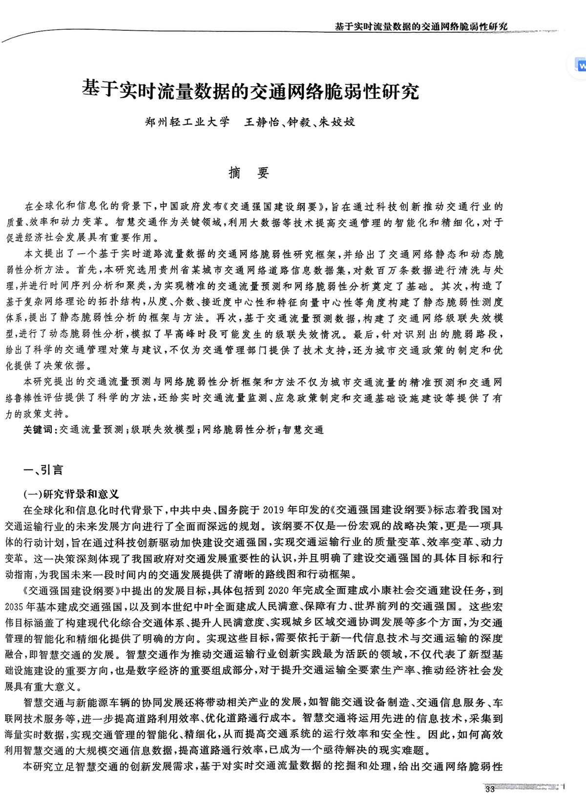

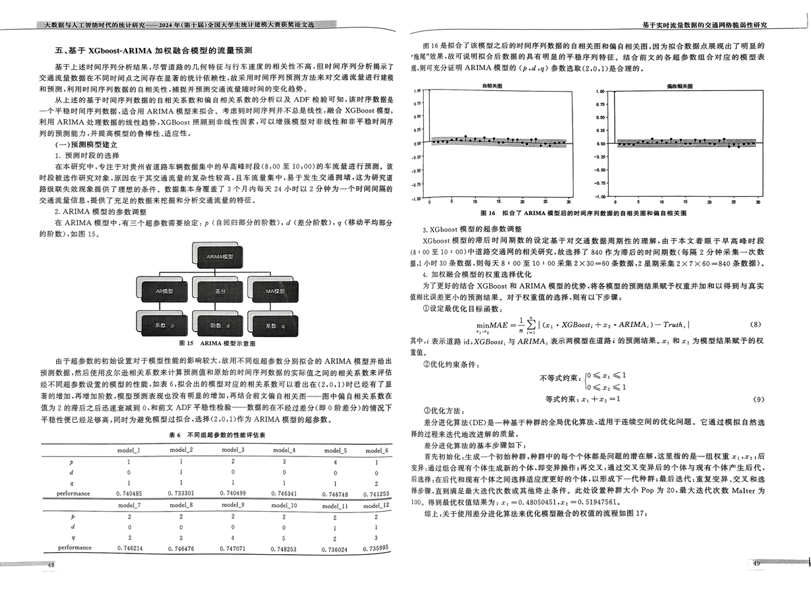

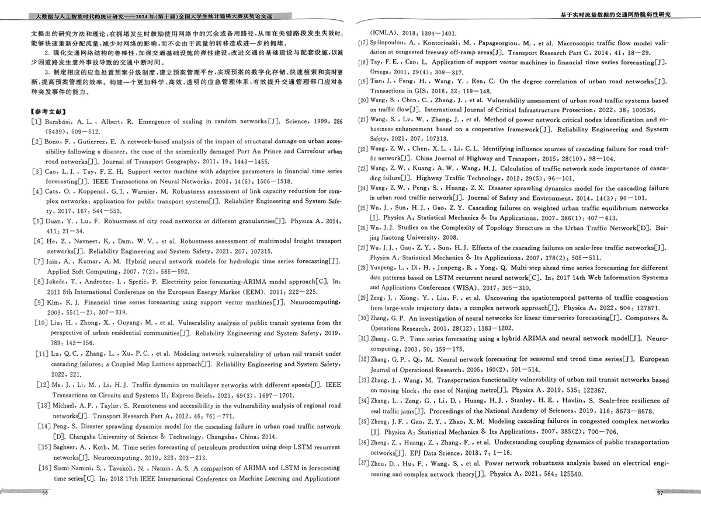

———

BF FOe Me Bk Wie We Os 2 ih EE

Qlink Fj 2 WF BF MH) Ae

MBM PIA T 2 SRA At AY (2min H— PAY ML) EA link OF Hy MT OT Hl, AE et fa] C5 MCAT AS Pl) JR eB OE) BREA link OY EERE link FOU METT OTP. FBLA 3 BER.

RZ lnk FLBTHRR

Link ID| string| SRBR link) He—KR  
---|---|---  
Date_time| date| BR. w%*201S—10—01’  
Time_interval| string| Bt A B . BY #22015 —09 —01 .00.0000.2015—09—01
00:00:10)  
Travel_time| double| SFRERRLSFSKANM (BH)

(>) RAR ER

BF iM BG 5 PN a A EH HR AE WP Te Me OE TT A AEE

1. KRESEDH

Dilh F 4 F344 BE MD BS 53

5

Aa RF AM Bh SF Hy BMA (OY SPA AR» MN 4 BER OBR SS he AF BS 1 J — HK JSP AB BOSH 38y MeAT OS MO) AL HC BR ANS 5 SATA AS 9 BB SO FS AF OP BC BO

Ee AU Bh 9 FCAT ORE NE AUT Ba SY BN AT 0 St RE RE, A SY a Sa 5315) ARESA A.

HS SHIRTAHERF HRT AAR

OESHRR

2a — DA Th OF HS TT BS (0) SM IE 5 TF BE SAG AI Q-Q FA (Quantile-Quantile Plot) MX 2 8a iN BF MB OO Sh LG CTE SP A A MI SP. SO 6 BEA KS I AE RO TET Be SOR be «RO EE ALBA TE AS SP AB «A — A 8 09 WS HK Se PAR HUGG SEB HAM Ay BH ik TT I.

2. 3¢ EA He HH fi

RRELESERR. BAAHF HRT ALBERTS EDD ARF 30 HEM ARRBAR KBD HM.

“pcos. prea

+ COMMA.

IL TOE WTF EL ANA Bh TED 20 PER OSS HA CAE LMS 0) FE SFT AE BD 5 IE, ME Bh WT CI AS Bh 40 RR CM 9 A Ed oS AER A 09 9 89 FE AE EE I AR 009 Hy BE A RA AE CAA Ek AS AE By OO. PRLED MR NAMI HA A

SLE 05 CAG 85 Hh OME OST HM SRA RMA. MRARMAGKE. TANS ED SF 25 18 OL 9 AR AT BE OS AO SE HE FE ERA ES So HR BS TK Ae at ME AT HO.

4. MMR it ses

MLSE BE (Road Length) : S25 @ 7 ill eK 1S 09 5) Ah EM UE WAS KB) 839 RARBG, HM 86. 01515 A LRM IK 113. 6054 K AMM KLZOHERAKORH, LYMAN RONRMARISE SH KERR ODED RK OE FMEA.

i FE KBE Road Width)» 5 46 BE M0 Mt. itl BE BE 9 5) HM, HY 9. 931818 OK, ORME 3.014452 K, MDRLEA 3K, BKSMMB SH ORME IA IZKZM, CRAMRMPE-HRE HMM CASRMROREREAK, Sm Ris H— At.

St FF 5) FBS) (Travel Time) ; 5 5 09 7F 5358 77 8S i) te oe th YESH HE FHM 8. 367045 B. PMI 2.403522 B, MMM OA 0.9 B. BAS MMI (75 % HF HM ATO MLE 7. 4075 9.75 B ZH. RYPSRRLNRH STAR RRH LEAH OROMTHMRM.MA—-MRK. HRs FR:

Rs SSORRSEREH ORBEA KTR

columns| count| mean| std| min| 23%| SOK| 78%| max  
---|---|---|---|---|---|---|---|---  
RoadLen gth| 132| 86\. 01515| 113\. 6054| $| 29| $5.5| 103\. 25| 839  
Road Width| 132| 9\. 931818| 3\. 014452| 3| 9| 9| 12| 15  
TravelTime| 132| & 367045| 2\. 403522| 0.9| 7\. 4075| 8.75| 9.75| 12.73

(2 MAAR

1. ADF #28

EZERRIA LEY BEEF FRAZER RAR ET ROM FAD TT. AKRAM ie

ge (METI TEIGG

}

WS EE HE

3. AMAR FF CE HM BG I Hy RBA RP Ae We MOL BR WC Ht Se A RRM. AT RIERA EME FOE. ME RK RTM.

HN A DR SP

ths RD

ERLE PIS TP ASF 4M ML Moving Average Interpolation) A] —7-#t 3) BT 0 TERT FEL SERRA OAL, BRC BAAR A PS 1) FE A OB SA SF) OS ADS HES at BS OA OE A Et CME CLO OL, DR, PAS AG EMR AS 1) PD eH SS a eH

S018 7 WINKS ID W% 3377906280028510514 ORR IA 4 AB) 6 A Oi iit MT Sy ate Py OS Oa OS A RIOTS , TR RTT TO EP A OO OR EL, PP OT Ck aM a6 Ae EL MEAT OS 0G) 9 A AAT RS OF AT 3 a OE FT AE HE.

PI CAF

HM JES = y-13y.,

@

TP, Y, AMT) RE ROMA TE. me AT RE LAD AC ANC RD 2k + 1, JH ke AR OA RAC BED, YY, ARS Pa) se

_ aoe

Be FFE Me We

Os 2

Hs GS TEE

&— BM CAvgmented Dickey-Fuller, ( ¥s ADF) #2 92 ill Bi F149 mk FF Ot OF AVE. ADF #9: 99 38h ich 11 3 0 159 He $8 LES OO) FF BG OS hy Ss Oe A 9 AE FE Ae 9 RJ FF Bh, SOM RIE TE LE MAD AR. BY A) BS 60) FE A a A OS RY.4—-TABAHAY,

8

|

ym by, tate,

«@

ORBGRARM 6 HMA. SRM EH. ASTROS OM OKRA M.A SRI OS AE 0 RIE BS AR Se lL AE AEA HR CDS IN MIC) St HT BE WR «thE SS Yt I SPATE 25 OM Rt ADE 129248 FIG ADF te tf fit 4) MUSE — 25. 525488, p— value ff JB 0. 000000. 9) ADF BEiTIRTE 1405 SEK FC AE 1, A p— value MDF SK AU HR ERRWFAR ERO.

2. PRED

BPW LED MEE — BS IF FNP = 4 EES BB SP 2 (Trend) . 2 WHE (Seasonal) MUR H (Residual) BUDA RSD. SP AT Wh WS 1) FN OS 2 Hy PA a, A Yk PF eS BI SP OT. AX T GK 24 ASME Se 720 Ae 9 HM I ROC C4 FD eA I RW Hy Oe PTS A DD , ELE PVEDRZE. ERT RGM OR. PPE RHR EM OM o ha. Mawr:

DASH ROH A HG BS 1 FF FM MS LH AS A aH 9 HI Es, AS ER BY hs 0 Si — 2 08 te.

DPB ERS . BW LEI I A EP of AEE os BS BR, BR a ME Re BE SU Bie 2 SF 9 HE HS 5 OO A . IPN AK IE) — FE

DIR ME RM MR DRE OE FO FE FP I Ze RA RS EAR SP I AS. A Re TF 05 PR he FL ROH ORD HER TD MEA MA TE ERE 09 A RR RAP 5 OK.

BLE SP BY LL HEE A BS kh a OF A AT SE. a AE OY EP OT LL SURGON AFAR RAM—AAGTARRAR.

3. AHIR TAR A SD OT

Gd tb eS ees 88 Oba Este Oh Lees bs ag SES) ARIMA BUDS — 0 8 0 (0) J PE AD «A dT AR 9 9 SA HR m8 10,

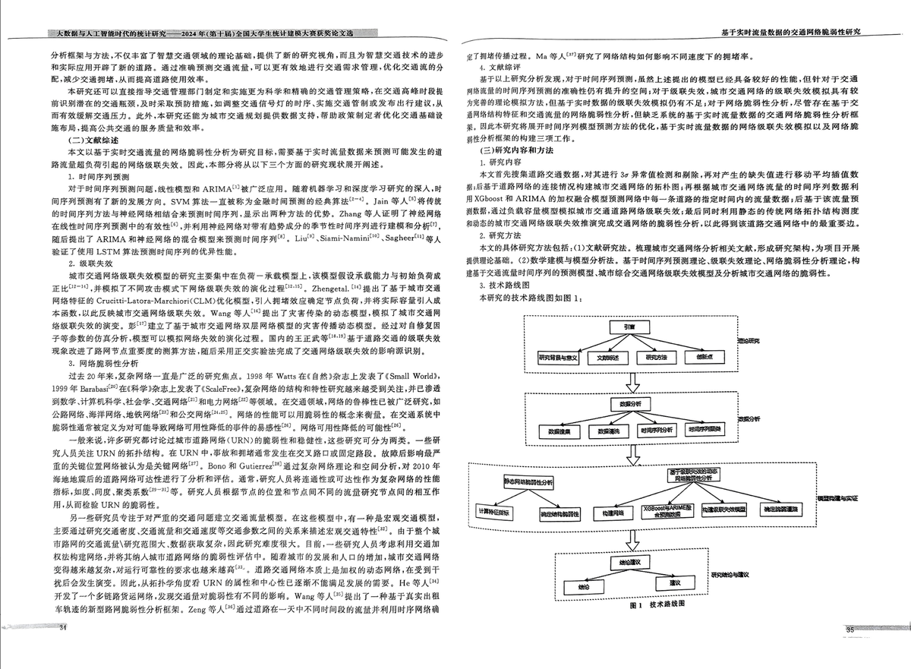

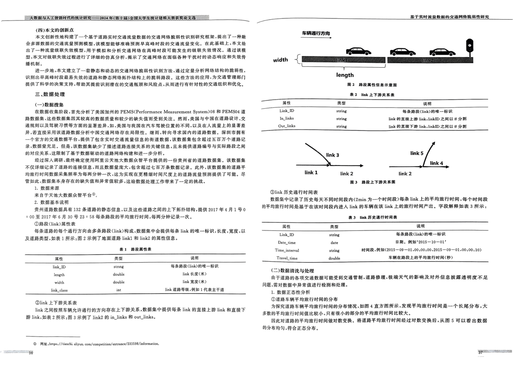

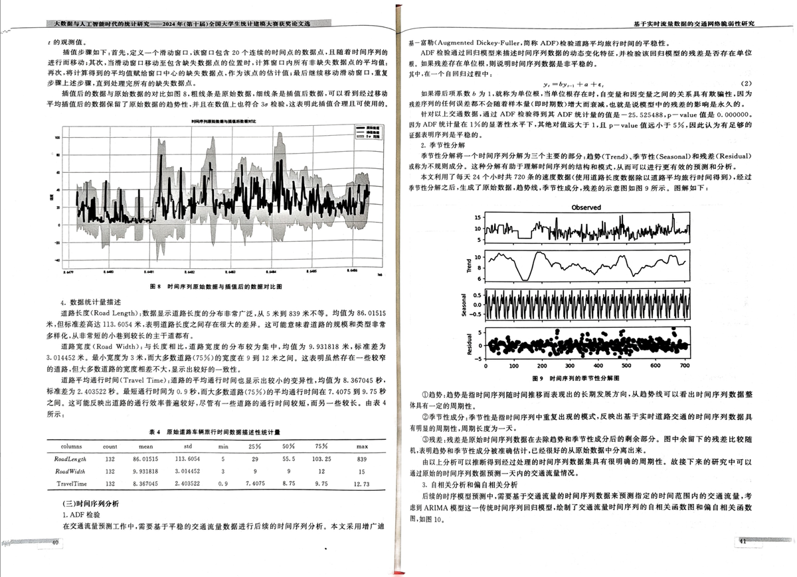

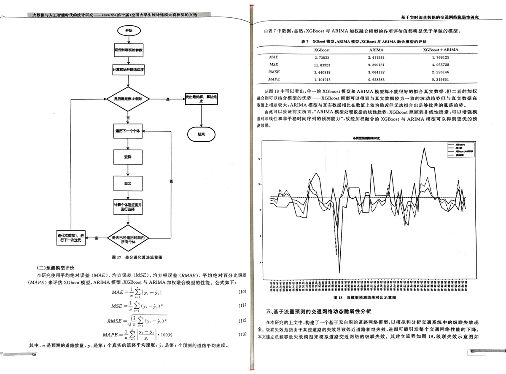

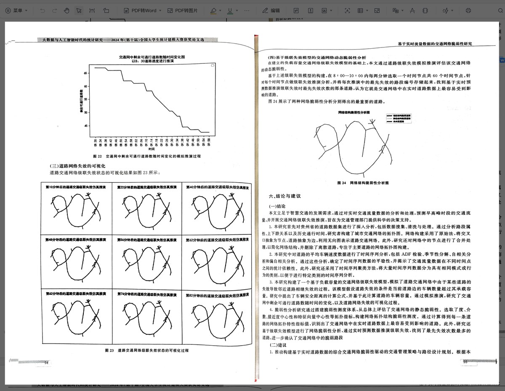

(09) BE EAE

HK AEBS IF OE 53 Hy AM AB VE) KWL AT a 9 (OFF FN HSB, A A ET HR A LS 9 OT PE BR ARIS MF 9 FDS ME BE T BT MRR.

1. BBE

AEE BS FF 3B LB 19 SE BH (Euclidean Distance) R—-H#ERE RHE RRA, KKB K-Means MASE. BILE 10 BE WHE HH 5 BES BE A IS KH OR oP YH WS. FE BAPE A KARI ASS FE AE MM LR 40 te ES Be Se OM) «BF A 9 A A HE FB DL 1G SER to EE I He HE OF

TBI (Elbow Method) B— BA FRE MAG P MEMRAM (K) OBR, ME K- means RAP ZEA. KARR OBIE. MEMRAM K MM, MARI FM (SSE, IMA RE Sum of Squared Errors) SERRL ALR ORS ERE. AAKA—T 2 — SSE HRORLAR.R—T" BB”.

R

1B 11 BY LAA B) SSE EMMA 3 AA — AAS RE 1B th Rh EB Oh 5 A HEA A Ha a RELEASE YAH KERMA.

# =. WF iM i Bea Be Oa 3 Ae HE PT

PS SCR FA UE Sth 3 HES SF aE FF daa Re DR IRD: Oy SUL Ba FF Ss eho HB Hs HG PRK, SEB ey th. HAE ABR A 2 Hy 0 A a BR ee «a 9 Ee a aT Be 3 PH.D 2KMF :

G=(E.V)

V=(v | v € nodeclement)

E=({e | ¢ € edgeelement) Vie lv, |v © Cejus r€sme))

DEH , 1 OS G FFA MG, VR IRA, ERMA. 0, ES Ce pree v€ree) REAR HILO LF Mit RAR—Th BM.

FARK IMA BP KR AM MPR RA MSR t#— nodeelement, BUMA“RBEEMR’“MMRABEARA“RHAKMREH SO SR te — edgeelement,

(—) eh et

RSF ME — He HM BES «NAY TAS AL, SA RR Be 9 a ak St — Si a OAR TL HOF A MF all Bes 9 1 FO HE EH NAG BI.

PIT 10 Ch AY RS PS OS EAT T EAL, BURT A — A aM Rs HG IC bE BO SAAMI BAM AH TOF BS SAM EMMA IH. ER—-NB P,P ERBRFS AA. RGM RH Mies MIE.

$25 WE LE SL BR Fe a tt BRA A le ae A a DS PTB, AG 09 te AP IB

is

(=) MA TA

4 RR HAs £09 SH Th PB EAS A 09 BA A AOL FR He GB OY AT A I Fa, MMAR AMM RH HUSA RMRSARAMEH HAS,

YMF MGB. OS EE 19 22 5 PS A BB PT LR A Ph HM Ee, i RE UMRASEKBRKE RAFHASCARLMSOMOM MOM LSAER EH eM ORR. HH, PRR Lh th Se Fh ME AS BR RR BIG 0 HE Bie, AE — He aE ST BF te EY A a a He 205 MLA AHR

oop TTT

(3)

# BaF Roh Me Aik Wi WE Os Ze EE

BE LF PA MR

mR

2,

LE FAG BB FF EIS ie HR ROU 12, BY La ONE BPR ahs = A) Se HE. NT le 02 FEIN BT ARI Sy = A IA

Riz RMFARRESPAAHSRAARR

# Me F Ket ihe Hit We WA hs 2 ih WA ee Bt EFL

C2) OE GMI RAD

1 FR ES Bs AS Nk pe MS OAT SE 5 AAS HH i A = Ee HEY SRE 0 15 AE HH RIE Wa At IU ETT ME SY Bt. Ay Dy EIR Aa EA FE IE EFT BT A, RE OF MR te RMS 14,

0 1 «EEL SJ «2 SO Ste ye aK Hk eA 3 He Heh BT Sa AS EE PS ts 005 I HE 8 IE A OG A A IK

Bu Rearenne

SR it, LBB BR TRE 9 RP FEF SN CR, Re a eI te 5 a Oe Se A LE SY REA SM. ch He OT SA EE Pl ey ESE EET

GE M19 25 8 i A IY 9 te AS SG eh a HO I AASHOSRB te.

CD) AR a Thee EI

AXHRARLALA TA OMRUVASHR, SHRKRIN ALARKAGSASRS KM AE PAE AE FE LEP EAA Bl 9 Sd Bs AE AR A Me OS HB OR HM Ph ER pS a SR, Mt SRBAEAL), GAMKREMME AAENENA NERS RAEARHUARARMRERAS PS RR 09 LB BAD I Se BE i Fe 9 SS EB FN He Sa HT a I SH PAE OY EACH AR ACC RS I A A a A

1

K (Degree) R—-T 8 AMM HK, TESERUARR. CHTLERRUNAP HT ao ez mM, UHRA AHECRUNM PIER PARAL SHASVA BLRVERS SPHERE, HRAKMF

Degree(e) = DA.

®

KP, ne AYN AMA Ag ROME PM e 2 MANERA 2. rk

SP ¥ECBerweenness) Bit T — Hite PE RIL EEO PRE. UR a EES AO RITE BEA CMS Re Se MG OAR EE aM OS HO Pe IE HE Mastin;

Betweenness(e) = Sy) 222

weet

Fu

(>

TPs oy RASA NA EPS Rs LRT AY Eo OIE EH 5 0 Co) FRA RE s BW AE e ON

ee

MF Ke WE A RA hs 2 a PO

HE I

HPO RIN « Mit. 3. Mee ME ao tt| ak| | | —______~siDegree~™”SCBetweeaness ~~ Closeness Centrality| Eigenvector Centrality Eigenvector Centrality  
---|---|---|---|---|---  
$i Me 4 Atte| (Closeness Centrality) i fit T — Sita BIA ICG 21 OOF 19 HS. 0 5
9 AE BE Pt| rood 21| ‘| 0\. 313872| 0.062003| 0\. 199447  
KU —ARUDIVET| MOF HERR RARER AMP, TAKE: 1| rood 22| 3| 0.029412| 0.045323| 0\.
012543  
eons| s| 0\. 479368| 0.075118| 0\. 005272  
——os iC) Closeness(e) Sain )| | 4| ©, $03512| 0.079104| 0\. 000123  
ne IEP, dere’) FEM ¢ WN’ MMM BAM.| ro0d_28| 4| ©. §08707| 0.079873| 0\. 000208  
road 26| 6| 0, 029412| 0.054202| 0\. 424738  
4\. GE it te| road_27| ‘| 0, 433275| 0.069443| 6\. 69E—06  
494 (a Hit P dt (Eigenvector Centrality) fit 7 i238 2B) 09 1 09 A, BO — his HY
BEA RR FEMATHAEROUM, ERAT CHERNUHREHE, THARME,| road_28| s| ©. 507024|
0.079857| 0, 000368  
rood_29| 4| 0\. 629412| 0.077034| 0\. 000335  
road_30| 6| 0.507024| 0.079857| 0\. 000563  
Eigenvector(e) => D Cele’) 7)| road_31| 6| 0, 029412| 0.054202| 0\. 424738  
CEN Cele’) J8i c' MATER HP Ot. A RIRKAHE. NCo) Bie OP KBE ROD.| | 6| 0\. 029412| | 0\. 424738  
road_32| | | 0\. 054202|   
r00d_33| 4| ©, 500439| 0.078456| 7.99E—05  
(TL) EF A EE Hs ER BE OF HEA Bi) 3B 325 1. PA — She SL BS AT HE AR A ROME SEAR
SARL AEP MC , LL‘ Betweenness’ ‘Closeness Centrality’ ‘Eigenvector Centrality’
= 48 REAM PEE AE 40 BY MBE MG 531 road_30, IL SLAT MOF HE:| ro0d_34| 4| 0,
210711| 0.046934| 4\. 11E—06  
| | | |   
road_35| 4| 0\. 233099| 0\. 048673| 3\. 35E—06  
road_36| 4| 0\. 138279| 0\. 054458| 0\. 184120  
road_37| 5| 0\. 313872| 0.084179| 2\. 78E~06  
RR Degree 29 6 KFA Lb F iis te iti 2 AE i i Bs ACA A HUA SEE A AES He a, Ae AN
I — i RBANSHMM.| road_38| 4| 0\. 331870| 0.056036| 2\. 1E—06  
road_39| 4| 0, 365233| 0.059837| 1\. S6E—06  
SPRL (Betweenness) OF ik 19 Mita TE i P 9 HF RAE A, BBS HEHE EP PAR PAB SP HE
Fa, BES RSP RMA 0. 507024, KTMARNM RAKANEMA PD SHFSMSRE LRT PM, Te Oe HE|
road_40| 4| 0, 380597| 0.061766| 1\. 66E—06  
road_41| 4| 0, 057946| 0.054420| 0\. 012259  
HLKOA.| | | | road_42| 3| 0\. 029412| 0.051691| 0\. 005787  
RS RHASPSE-KMBHARBNNR MRE| | | 0\. 433275| 0.068449| 0\. 045423  
road_43| 4| | |   
road_A4| s| 0\. 421422| 0\. 066613| 0\. 085040  
| | | | | | | | 3\. 08E—06  
| j| Betweenness| Centrality Eigenvector Centrality| rond_45,| s| 0, 275241|
0\. 052320| 02E—06  
road_0| em| 0\. 212379| 0, 045081| rond_46| 4| 0\. 254609| 0, 050468| 3.  
| | | | road_47| s| 0\. 187445| 0, 045255| $.4E—06  
road_1| nn| 0\. 085601| 0, 023777| | | | | 4\. 29E—06  
road_2| nenenwnnuanne| 0\. 454346| 1, 74E—05| rond_48| 4| 0, 421422| 0\.
067554|  
| | | | rond_49| | 471905| 076405| 4\. 76E—0S  
rosd_3| | 0\. 463565| 2\. 86E—0S| | 5| 0.| 0.| 4\. 7E—05  
road_4| | 0\. 138279| 0\. 084940| toad_S0| s| 0\. 085601| 0\. 074616|   
| | | | | | | 0.077639| 6\. 29E—05  
| | 0\. 085601| 4\. 44E—06| toad 51| s| 0, 496488| |   
| | | | | | | 0, 076938| 0\. 000495  
| | 0\. 112379| 5\. 5E-06| Foad_$2| $| 0.087946| |   
| | | 2, 7SE—06| road_$3| 3| | 0.071594| 0\. 000238  
| | 0.029412| | | | 0\. 029412| |   
| | 0\. 491659| 0\. 001576| road_$4| ‘| 0.029412| 0.071901| 0\. 004856  
| | 0\. 485953| 0.002842| toad_$S| s| 0.057946| 0, 043525| 4\. 96E—06  
S| | 0\. 294996| 0, 380801| toad_S6| 4| 0\. 408692| 0, 065636| 2\. 86E—06  
rosd_}}| | 0\. 138279| 0, 526314| toad_$7| 4| ©, 395083| 0.063703| 2\. 06E—06  
road_12| nena| 0\. 163301| 0, 346308| toad_58| 4| 0, 029412| 0.040305| 2\.
98E—06  
road_13| | 0\. 085601| 0, 051538| road_S9| 4| 0\. 348990| 0.087924| 1\. 71E—06  
road_l4| | 0\. 057946| 0\. 026572| toad_60| 3| 0\. 029412| 0\. 065306| 1\. 36E—05  
toad_15| | 0\. 029412| 2\. SE—06| foad_61| $s| 0\. 500439| 0.079386| 0\. 000704  
road_16| | 0\. 029412| 0\. 424738| Foad_62| 4| 0\. 496488| 0.078549| 0\. 000950  
road_17| mene| 0\. 454346| 0\. 013662| toad_63| 5| ©. 331870| 0, 064447| 0,
130187  
road_18| | 0, 444249| 0, 024501| toad_64| 4| 0.029412| 0\. 040305| 2\. 98E—06  
| | 0, 444249| 1.07E—0S| toad_65| 4| 0\. 057946| 0.069724| 2.66E—0S  
road_19 goad 20| pm| 0\. 112379| 0.007718| ~~ Pad_66| s| 0\. 463565| 0.073635|
0\. 008443

OT. A

qpaear ose

# MF Ft Me $e NG Os 7 hs WI EE FE

(LOL A

# H.-F XGboost-ARIMA MRBARAHHKHRAD

BF LEAD ADTAR RMB LAP EST ERO MAHAR (BSA RT C5 ME ARR SOA AA UB) (0) YF ES A YE RE AR FAN A) FF 2 BB By 2 A FORA IY «A FH wy Ll) FY WN cH A A 5 A I SE 3 IR a 5 Hc AGB .

pee) Se OL ge ee ec Dts re me. ei 6 2 FF BET FUE TAA ARIMA SRG. SBP Y AIA RARE MA XGBoost MA, UA ARIMA 2b38 88 19 REF. XGBoost FHLB) He Ate MK , FY CL He A AY SF RHE AEF ea AGAAKA FREMAOBSH mt.

(—) BUS ee

1. MMH RGR

EARP WEF RS MEIN GM eA ME oP 9 I A RT BCS .00 FE 10,00) HH ME MEAT BM, Ot BREE HE DESERT Re EF IC MM AER. MM RE eH ER BRRARRRBET MOR, MEMERMRT 3 CAABK 24 MU 2A TH SE ELAS ET FE ZOOS A HE A OT ME IE.

OE) 16 FAL eT BA OY ZF DONS) FE BOA Oy AT AA A, 2g 9 eS Hs TD HIE RR «ST BA IL Ae A HG 5 SAT OF BIE HA AE. 48 HY Me A BM A A OT YR RMA FEIER ARIMA MMH (p.d.q) SRBAR(2.0, DRARH.

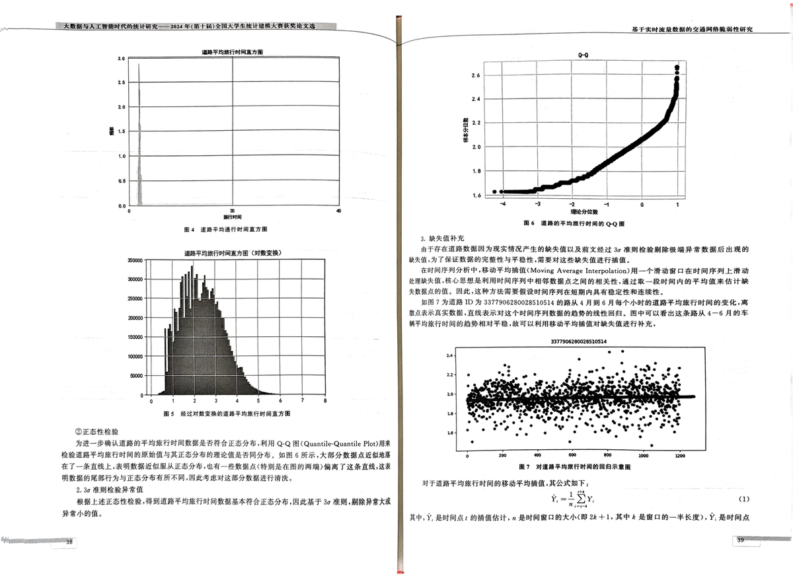

2. ARIMA #5) SS gs

ARIMA SY} A=ETMSRBERE: p (AMABAORM).d BARRO, ¢ BHAEHBR AO BTM) MIB 15.

3, XGboost HE 0 A) i RH RE

XGboost BEY A975 a BY (i) 95 Sk OY 12 EF RA EE. AMS ee (8+ 00 HB 10 * OO) Hil Se 30 Mi PAYA GESE HET 840 HEHE OS Bt RK SEE 2 ERM — KM 1 ABT 30 He BAM MAE 8 + 00 HB 10 + 00 RM 2X 30—60 MMM.2 RRM 2X7 X 60=—840 MMM). 4. DOERR Ge US 0 4 HP A

AT US Hi & XGBoost M ARIMA BUMS (EH 45 Ge BUS OY BY A RF 0 IE LL 9G BAG PE MAREE HAMAR. MERAH MAUP SR.

ORERR ABR.

minMAE = 2 5} | (x, + XGBoost, +21 » ARIMA,)— Truth, | «)

ayy

ni

Bis ARIMARSROH

BFRSAHMBREUFRVERMBARK AAFASRSEKS ASA ARIMA RARE PROSE IRE RRA RK HEH EM (A 25S OB PE A 9 SO 9 A BOR SA ES AR MO AS HEME. SME 6 A OO OS MAM (2.0, Re SHTS ME OS Yn HE SA Sa Bit Se RY HE IM eB eB AG 5 HE A 2 A —— Pb HR IE {5 2 OO FE EZ GTR PER 0. AUNT C ADF FB 1 te Me —— I Or) ZEA Ht HP DO BRIE SP) ON FEE 2M . Bt Hy EM Ht IR FEC2.0,1 1 ARIMA MM OMBM,

NP i RAMP id. XGBoost, 5 ARIMA, RAP CME M i OPM, 2, Mx, APU RR FE AR mit,

ORC HAF:

RERK: Css <a O<z: <1

SRHK: x, +2: =1

Oca:

«9)

# RO FOAKSOMMA MMAR

| model_}| model_2| model_3| model_4| model_5| model_6  
---|---|---|---|---|---|---  
| 1| i| 2| 3| 4| 1  
av| °| i| 0| °| °| °Q  
2“| 1| 1| 1| 1| 1| 2  
| 0\. 740485| 0\. 733301| 0\. 740499| 0\. 746341| 0\. 746748| 0\. 741253  
model_7| model_&| model_9| model_10| model_1}| model_12  
| 2| 2| 2| 2| 2| 2  
2nvwv| 0| 0| 0| 0| 1| !  
| 2| 3| 4| §| 2| 3  
performance| 0\. 746214| 0\. 746476| 0\. 747071| 0\. 748253| 0\. 736024| 0\.
735995

BA BAC M I (DE) — HB FHS MCE A PRS SC. CBU ae He NE Hee 1 Sh IE 09

MSDE AC TEE OY AS RIO

PEED hit es AE — Ta ih PY OE a I — AE x, ee EF BASRA ROME. MERE HR MULRSHEHTESRATEPESR, SSH. EERARATHZMRARRAEEOTH, ERT -RER MER, ERR AR HEBBEN IA ERC RIE HB HE IE AE. HORNER ERE) Pop 8 20, MAB AR KM Malter 100, OB) EAL (MEA IR» x, = 0. 48050451... = 0. 51947561.

Ss 5 KF RD SP HUE A RE ME AC BU HR GO A CAL 9 BAER 17

EEG

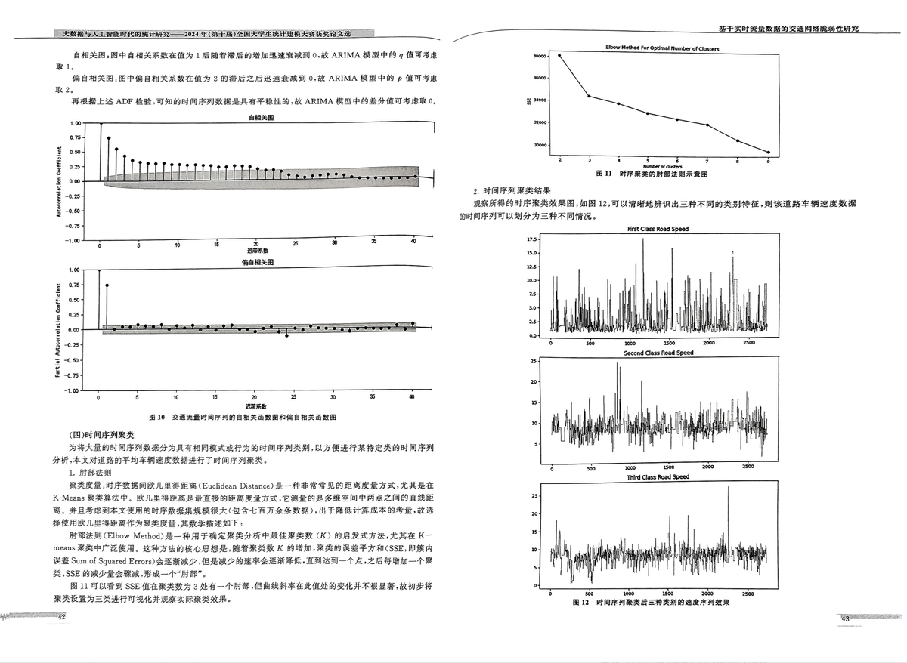

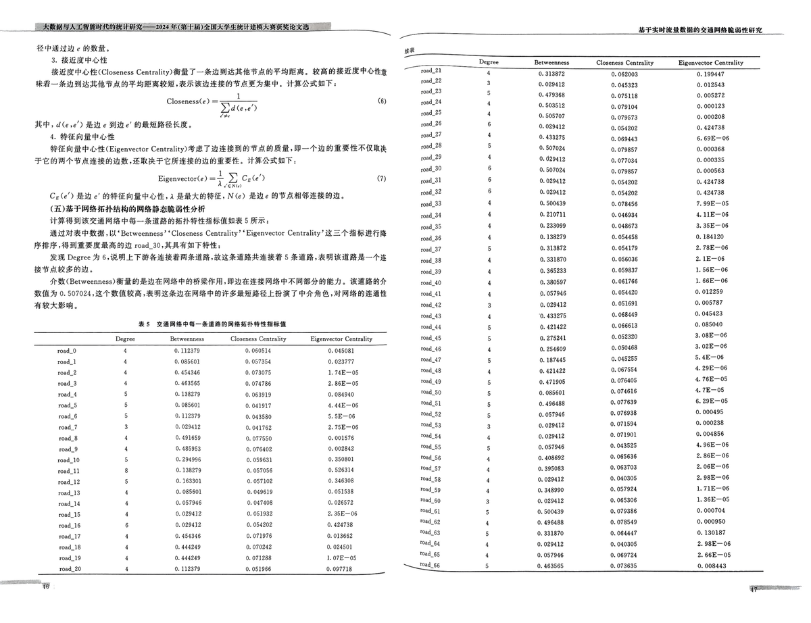

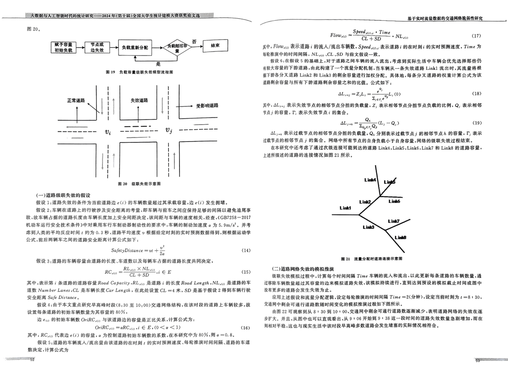

(SUN IF BE AREF RH (MAE), HARB (MSE), HH MBH (RMSE), FHMM AP CRS (MAPE) i#4& XGboot HUH, ARIMA 8L48.XGBoost 45 ARIMA MRBABM MEME. Ati: MAE =23 3,-5.1 alee MSE =+5)(y,-5," = RMSE = [+3)¢,-5,)" n mare =+3)|2-—%|. 100% JE 5 me EIN ICA, SIS AB I 5, I 6 A

I

8

# £20 QRARTSR

(HEF BRE RC PRA

Bil): MHARORAAS MMR ei) HEARMBUIMKRSM.M c(i) RERM.

Bk 2: FSRELHEMHTRBRLSER SSR PEASWEZOKRHASHAMUBLBEK 8D 5 ACE SA As 2 9 SMT BAB ahs HK DE tS a ED SE «TK OBE 5 A OY HO HK, ME .CGB7258—2017 MDS ZGRLMARAF PY ISAT SH Bh 8B SH HE HIER P , FAY OS) MOR @ 5. 9m/s'. HAY SEB) AZO FH) Be OF (A) ¢ 2579 0. 3 Ob, MPLS ME vy MN Heh OS BS DCS HE SC A BN, A Bh AK WE EZ (0) 15 SO Be ea TK BF

SafetyDistance = ut +e

# Bi 3 SP SHE SM RH OK OE ORS SEE

Run w Rese X Nh aw “ "CL +SD

sg

JOP PRM § Heil E09 MEH HH Road Capacity RL. MiP i HARM Road Length NL) Mi ¥ SM Num ber Lanes CL L® WK Car Length, MMi M CL —4 HK, SD RIF BR 2 WHA ATH BASEN Safe Distance,

Bi 4 FAK AHIR MG MOE BLS 30 10 500) EH PAH HAH » AKO BR Ne eR ae 5 ARM Aes HS 09 9D HA MCE ICG ME 80%,

YD ey SUMGEBK ORC cy SHMBAOSRLE LKR HRARH:

OriRCuy ARC yy, si EC EO <a <1)

FOP RC ay RAM ei) MBE AH AAS HB th SO HM EASED Hy 80% Ma = 0.8, MBAS 5 SUL Ble) EA EA / i th eh SL i 9S Bh ky RNS BD «A A BCS) 0) «te = BRM HMARA

Aa ORY

a

gp

aD

a»

aa)

a

ogy

BFF Me A

HG 0

2 PB HEE TE

th

87 PCM IK .XGBoost 45 ARIMA S040 2 BUS OY TLE A (105 A SD

1 FS 5 EY

MM

| XGBoost| ARIMA| XGBoost + ARIMA  
---|---|---|---  
MAE| 2\. 73823| 2.411524| 1\. 766125  
MSE| 11\. 83923| 9\. 390131| 4\. 955728  
RMSE| 3\. 440818| 3\. 064332| 2\. 226146  
MAPE| 1\. 104913| 0\. 628383| 0\. 319651

ABS 18 BT LAF ts MR —O5 XGboost MAM ARIMA MMII A ME BS OSS A IE 1 — OAR NT LL BUS 5 —XGBoost BES BY L195 45 BE Be eM Bz ty — 9 Bh AO BM 5 a EE MLL MIR BEA ARIMA ABCD 95 OD: SO HC Oe 2 i Ws a HL Ss A OD th St PY OE BT ARIMA 0 0 it EC 0 AR HE AD. XGBoost EMI ti aR te OF IK . BY LA St a SAR HE AE DS FO FFP) 09 A WE A)” A MAO XGBoost 45 ARIMA MMF] LLG BELO BAR.

# A BFREAMVOLAAADERB EDM

RI AR

PEAS BEIE OS be Hf MRT A EO Ps I SE 3 RE SR A Re Me AIT BO) RB SU A eR HAE TT ST AE A as HE BEF XCM, Rt eR SD AB YOU as 22 as 9 A RR J AC 19, HA eR A

ramon:

Speed Flowyy =

uy, ¢

Ti

HP» Flow, RAT | MLA / HEAR, Speed cy, HARK 1 TERY RS 1 IA HUM ME, Time 2 SE RICP HOT MR, NLio CL.SD 5SMXRR—K.

Li 6 5 EMAAR 5 Oy Be Wh be, EF SUL Bas ZO Ai sy A ARN DS EB A Se Ha BB 8 OS HRA ESF GS a RAGE TT — AR OU SE — eR AM Link] Be Ot ICM a HE AR BFF KMPH Link2 #1 Link3 (SORBET AL SPM. RH A RH A MH EA WR SRARERS AF UBM ERZ MGM. AKMF.

2 e 4L,., =Z,L, = zl.) vere

as)

HOP, La, RAIA MONAGHAN SME. Z, MORALE ASH RA REO HCN. Q, BEAR ANGE HA WORM, Dy Hem RMA: OMA.

AL ys “gh ~Q,)

as)

AL RAB AMD ASN ME, Q, PUR AMRB A; AMT AA MEI. PBR Mitt See CM LULA CLE Tt eae tte

eA BECHER AT US Links, LinkS , Links, Link? #0 LinkS 49S Be-BFt EE A I 9 AA 2. BE

# ———EE

(3 a Fee Bean He

RARE AOL kt BE EI AE AN RE Time AE LARUE CL SLE Bie 95 SO lk Aa St I ARR a BN ST ak eR RRS UE 5 A Ss HB A 9 SL AR Bt Pl) We Bf BA ME & 0) A Whe Be BR Ae ROW AE

SSL A Ri MEH SP EM AO HM HY TE Time = 2H RE MOTI ¢ =8 + 30, EAP a aL A RE A OT MAT BF BS BR.

(hE 22 ALARA BUAA 8 + 30 BH 10 + 00, 5 RATAN eT SM 47M GE SRT Re a IO Se Ha DA, HEA MT eT ULMER AA 9 + 06 FERS 9 + 33 3x — BROT Al 5S RR Se ee BUS Im EE MMURESF AS et 85 eM SB eS eH OY SRA ORAL

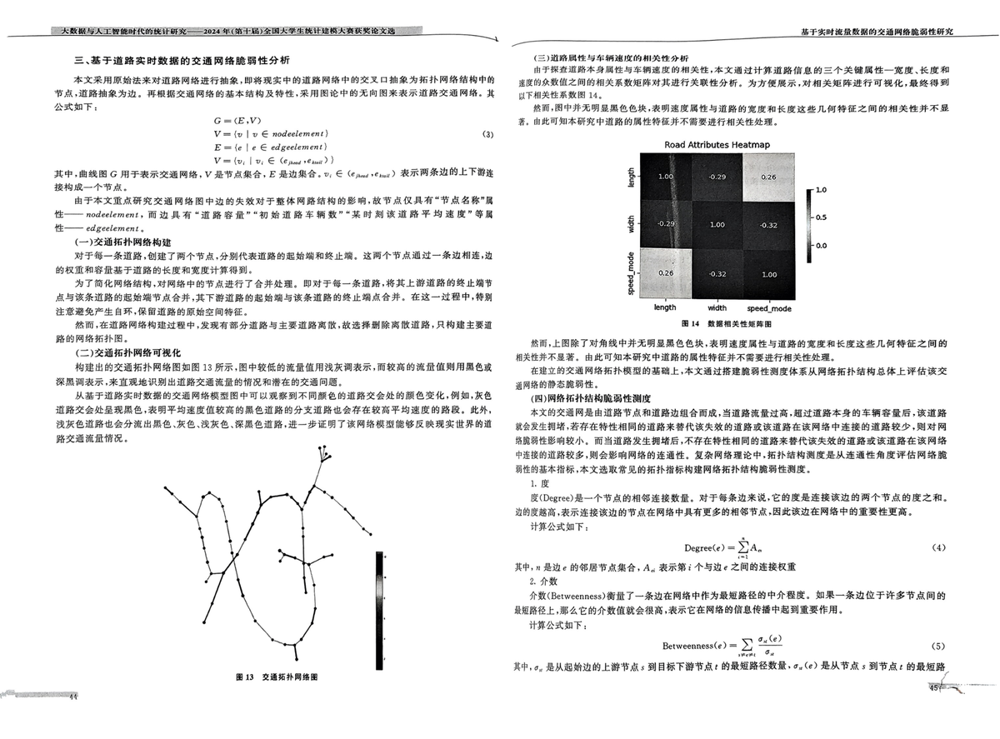

FG AT

SCE Me

OY ESE Dy Be ANH A. ZEAE BR AE

IR Bah OR FF Ae 2

9 TT ee Me FB AE

AA TG eK ARB BRA AE Ke,

the 5M We BH SMe HE AAR «AR AS Fe os, TA Se ehh EA Se AE — 2 2. SARA 3b ts 449 Ae «Sa A 2 A a AH MH DR DB AIK Bis Bee EE A 9 2S aS HH)

>

3. A SE ABT AB 69 A FOES A Ol I BI ASS BRR TIS OS 1 a A RA OE HF RERREAGHKRK, HE—TEMAK WR RANTA TMK, HRA ZT MBI RS PRAGEHEA.

# (eax)

(1) Barabési. A. L.. Albert, R. Emergence of scaling in random networks[J]. Science, 1999, 286 (5439), 509-512.

[2] Bono, F. . Gutierrez, E. A network-based analysis of the impact of structural damage on urban acces- sibility following a disaster; the case of the seismically damaged Port Au Prince and Carrefour urban road networks{J]. Journal of Transport Geography, 2011, 19; 1443-1455.

[3] Cao, L.J., Tay, F. E. H. Support vector machine with adaptive parameters in financial time series forecasting[J]. IEEE Transactions on Neural Networks, 2003, 14(6); 1506—1518.

[4] Cats, O. . Koppenol. G.J., Warnier. M. Robustness assessment of link capacity reduction for com-

plex networks: application for public transport systems{J]. Reliability Engineering and System Safe- ty, 2017, 167; 544-553.

[5] Duan, Y.. Lu, F. Robustness of city road networks at different granularities[J). Physica A, 2014, 411, 21-34.

[6] He, Z., Navneet. K., Dam, W. V.. et al. Robustness assessment of multimodal freight transport networks{J]. Reliability Engineering and System Safety, 2021, 207; 107315.

(7] Jain, A.. Kumar, A. M. Hybrid neural network models for hydrologic time series forecasting{J). Applied Soft Computing, 2007, 7(2); 585—592.

(8] Jakase, T., Androtec, L , Spréié, P. Electricity price forecasting-ARIMA model approach{C]. In: 2011 8th International Conference on the European Energy Market (EEM). 2011: 222—225.

(9] Kim, K. J. Financial time series forecasting using support vector machines[J]. Neurocomputing, 2003. 55€1—2): 307-319.

[10] Liu. H.. Zhong. X.. Ouyang. M.. et al. Vulnerability analysis of public transit systems from the perspective of urban residential communities[J]. Reliability Engineering and System Safety, 2019, 189; 143-156,

(21) Lu, QC. , Zhang, L.. Xu, P.C.. et al. Modeling network vulnerability of urban rail transit under cascading failures; a Coupled Map Lattices approach[J]. Reliability Engineering and System Safety, 2022, 221.

[12] Ma, J.. Li, M., Li, H.J. Treffic dynamics on multilayer networks with different speeds[J], IEEE Transactions on Circuits and Systems IJ: Express Briefs, 202], 69(3); 1697-1701.

(13) Michael, A. P.. Taylor, S, Remoteness and accessibility in the vulnerability analysis of regional road networks{J). Transport Research Part A, 2012, 46: 761—771.

(14) Peng, S. Disaster sprawling dynamics model for the cascading failure in urban road traffic network (D]. Changsha University of Science & Technology, Changsha, China, 2014,

[15] Sagheer. A. , Kotb, M. Time series forecasting of petroleum production using deep LSTM recurrent networks[J]. Neurocomputing, 2019, 323; 203-213.

[16] Siami-Namini, S. , Tavakoli, N., Namin, A. S. A comparison of ARIMA and LSTM in forecasting time series(C]. In; 2018 17th IEEE International Conference on Machine Learning and Applications

oes eee yy

MF Kt Me Wh

ie WA Us 2 i RE

PR) AF RE Be EBS A) Ze th A ‘GE SI 1) a RF MR 5S OR poset. AF LEA AAS 1) GA LE 8 + 00—10 + 00 115 PSP Pm — POT MU ALTE GO Pet mL Ht AAT DS EMR HT» SE AG FM ST Ble the 2 I Rt BA IR HEI he SB SN Be AE LH HR ane. 24 EAR TPP PAH 0

A > he Det «AS HM Dat SB A

Re PAB ASL

AA ie 2

1

eb

a

A

hu AseHRaAsee

# K BESBK

(ie FXLA TF RRRAORRER AUUKALAREAKHSKALA. AAP RST RH CAR R FFRLERARRAAH, REA TH TABIAENSHRM SI.

1. AOERE DT PERT BE HH Pi 09 HM BE HE AT TBA SPT EE AE. MT TR FPR RL BEG 5 FF OS AM) EE A AT RR SS a RT te Ee URS I0 SIE RB ah Ayn A YD SG yO 2 SI Rs EP ETT A EAIN ACPA SR EA OD » SE A Bie TRS POCA “ee RE EE a

th

BR

2. AR DESE P RF iM Be 9 FH 9: Sa BE ARE AT TT SP oT LIK ADE 2 LEM KS FRORAMKDG, BUR. AS TOMAR FRE. MN TRE EH Pet i ZOE, SE ERE RA TOM) PE AS a AC PE Sy SA A SR DORIA VA GF EAT A 5a 9 BS FEIN SPF.

ba eee belts be Let ee tee be UL aT ee 2d) 67) FeO MELE a A A Aa he a OA SY A 9 A a Ba 9 HA aE fh. FNRPRATRAKSERGOHRAR FHFKTAMAOSAER. PUMAMRR,. KR T a FAP Ae OT 5h FF AM Bh RS (OE A, «LR aT A A FT RACE

4 READ HARRLARRBEWTKR WSK EIMAT SERS OMSRBH. BRT LSE PORANEM POR SHRINE. SEAR EIMASRSERS. BLTKSAS—AM A009 VO a a LI a2 ee tH Ee EEE MF EA AS UE AT TPs te SE «BA A IRR NT I ER SD AT i

(SiR 1, RHOLEFRAMBREORS LAMSRGERHOLA TARR SRE RTA. MRA

geome |

# Me F Det Me Wk WI We 7s ih fs WO te Fe

(ICMLA). 2018; 1394—1401.

(17) Spiliopoulou, A. . Kontorinaki, M. , Papageorgiou, M.. et al. Macroscopic traffic flow model vali- dation at congested freeway off-ramp areas[J). Transport Research Part C. 2014, 41; 18—29.

18) Tay, F. E., Cao, L, Application of support vector machines in financial time series forecasting(J]. Omega, 2001, 29(4), 309317.

19) Tian, J.» Fang, H,, Wang, Y.+ Ren, C, On the degree correlation of urban road networks([J). Transactions in GIS, 2018, 22; 119-148.

(20) Wang. S.. Chen, C., Zhang, J. , et al. Vulnerability assessment of urban road traffic systems based on traffic flow[J). International Journal of Critical Infrastructure Protection, 2022, 38: 100536.

(21) Wang, S.. Lv, W.. Zhang, J.» et al. Method of power network critical nodes identification and ro- bustness enhancement based on a cooperative framework[J]. Reliability Engineering and System Safety, 2021, 207, 107313,

(22) Wang, Z. W. , Chen, X.L. , Li, C. L. Identifying influence sources of cascading failure for road traf- fic network[J}. China Journal of Highway and Transport, 2015, 28(10): 98—104.

23) Wang, Z. W. , Kuang, A. W., Wang, H. J. Calculation of traffic network node importance of casca- ding failure{[J). Highway Traffic Technology. 2012. 29(5): 96—101.

24) Wang, Z.W., Peng, S.. Huang, Z. X. Disaster sprawling dynamics model for the cascading failure in urban road traffic network{J]. Journal of Safety and Environment, 2014, 14(3); 96—101.

(25) Wu, J.» Sun, H. J.» Gao, Z. Y. Cascading failures on weighted urban traffic equilibrium networks UJ]. Physica A; Statistical Mechanics & Its Applications, 2007, 386(1); 407—413.

25) Wu, J.J. Studies on the Complexity of Topology Structure in the Urban Traffic Network[D]. Bei- jing Jiaotong University, 2008.

27) Wu, J.J... Gao, Z. Y¥., Sun, H.J. Effects of the cascading failures on scale-free traffic networks{J). Physica A; Statistical Mechanics & Its Applications, 2007, 378(2); 505—S11.

(28) Yunpeng, L.. Di, H. , Junpeng, B. » Yong, Q. Multi-step ahead time series forecasting for different data patterns based on LSTM recurrent neural network(C]. In; 2017 L4th Web Information Systems and Applications Conference (WISA). 2017; 305—310.

(29] Zeng, J.» Xiong, Y.. Liu, F., et al. Uncovering the spatiotemporal patterns of traffic congestion from large-scale trajectory data; a complex network approach[J]. Physica A, 2022, 604; 127871.

(30) Zhang, G. P. An investigation of neural networks for linear time-series forecasting[J]. Computers & Operations Research, 2001, 28(12); 1183-1202.

(31) Zhang, G. P. Time series forecasting using a hybrid ARIMA and neural network model[J]. Neuro- computing, 2003, 50: 159—175.

(32] Zhang, G.P., Qi. M. Neural network forecasting for seasonal and trend time series[J]. European Journal of Operational Research, 2005, 160(2): 501514.

(33) Zhang, J., Wang, M. Transportation functionality vulnerability of urban rail transit networks based on moving block: the case of Nanjing metro[J]. Physica A, 2019, 535, 122367,

(34] Zhang, L., Zeng. G., Li, D,, Huang, H. J.» Stanley. H. E.. Havlin, S. Scale-free resilience of real traffic jams[J]. Proceedings of the National Academy of Sciences, 2019, 116; 8673—8678.

(35] Zheng, J. F.

. Gao, Z. Y., Zhao. X.M, Modeling cascading failures in congested complex networks (J). Physica A; Statistical Mechanics & Its Applications, 2007, 385(2): 700—706.

(36) Zheng, Z., Huang, Z., Zhang, F., et al. Understanding coupling dynamics of public transportation networks[J]. EPJ Data Science, 2018, 7: 1-16.

(37] Zhou, D., Hu, F., Wang, S.. et al. Power network robustness analysis based on electrical engi- neering and complex network theory[)]. Physica A, 2021, 564: 125540.

Bymnsaeneres
