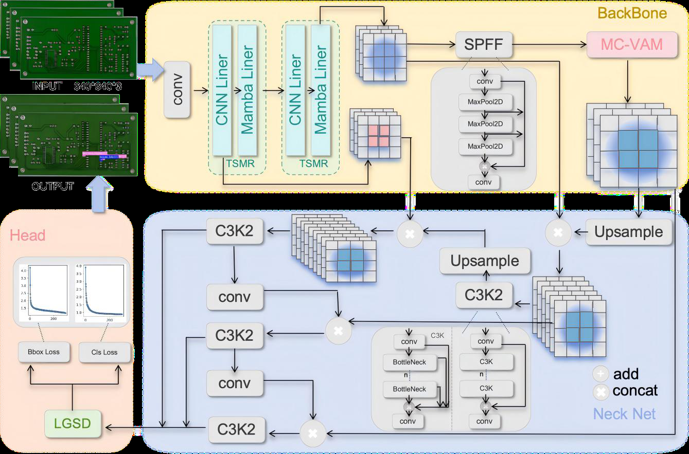
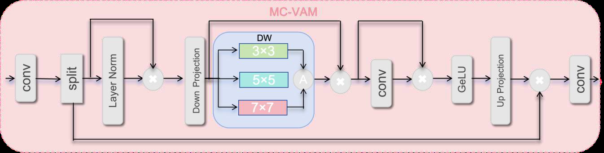
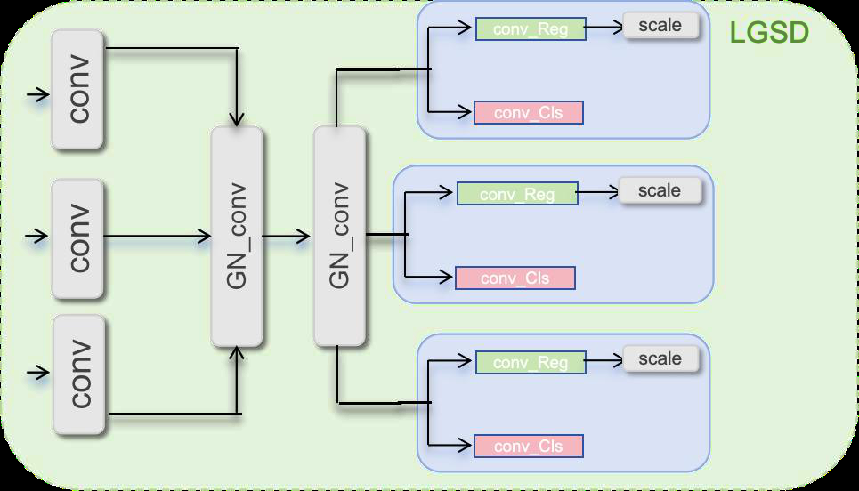
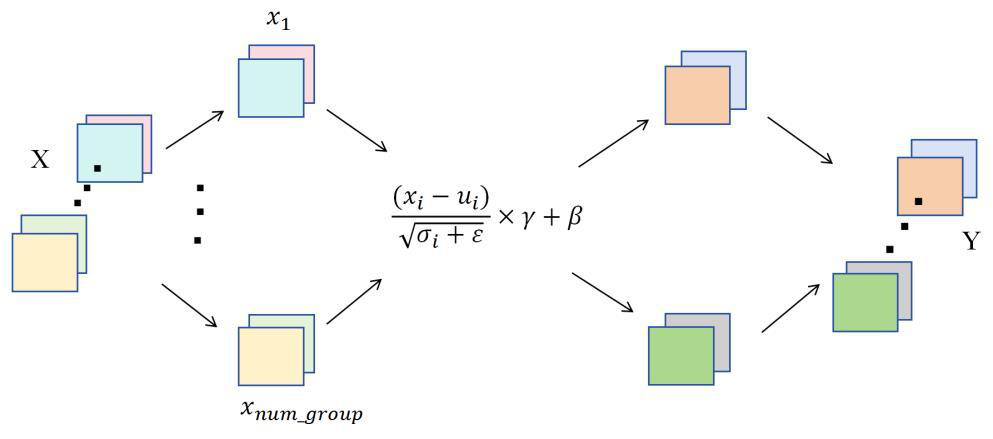
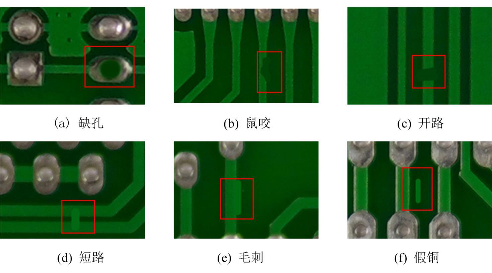
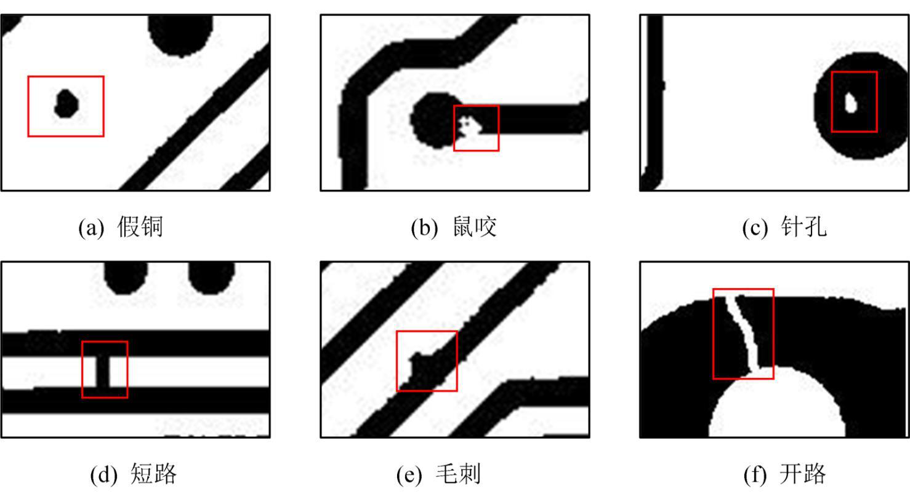
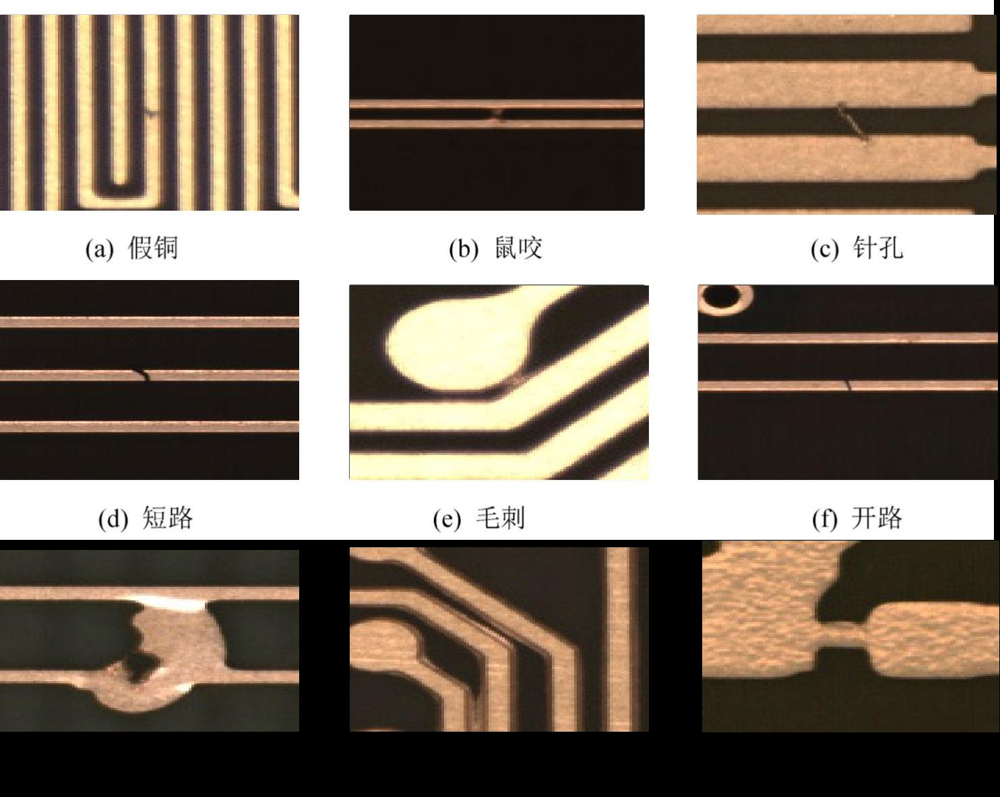
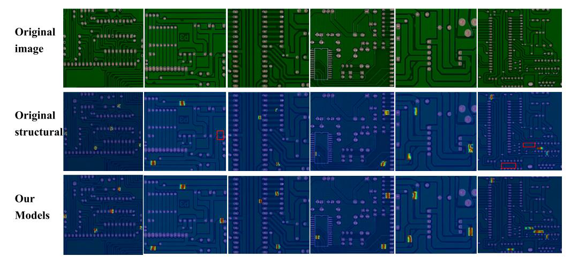
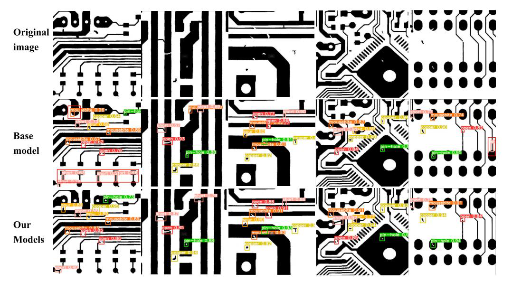
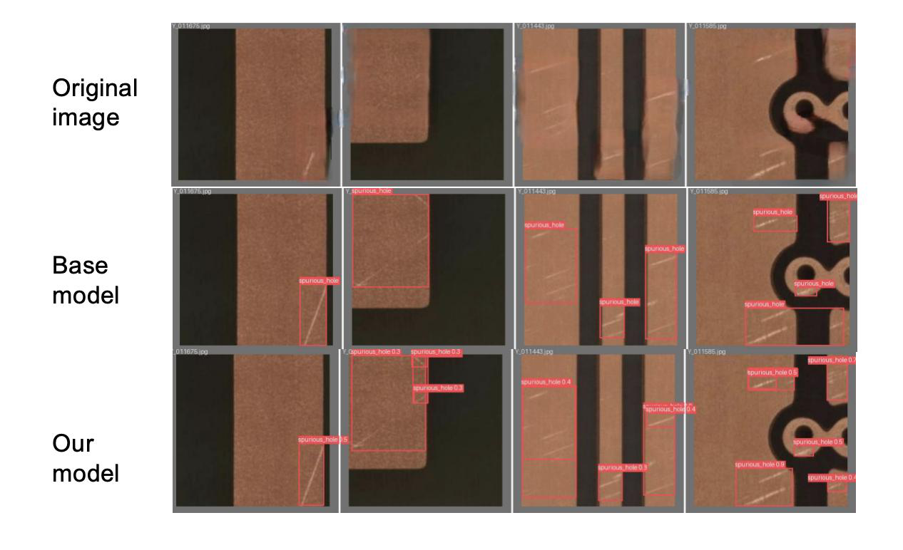

# MASH RERESM (BH) ix

2024——2025 “44 SB Ae

# (BiG Mamba K211 Fl PCB ski RMA )

ID| cece
cccceccscsesesssassesesssasacscsssesassesssssacseseusvassescesssssesesssacaesesseasacsesteecacseseeeeas
2  
---|---  
ES TRU IR oe cece
ccccccccecsesssesssessvessesssesssesssesssessesssesssesssessessesssesasess 3
VL FR 3  
1.2| BY
ceecececcssseecsssssseccssssssecsssssssesessssssssssssssessssssssessesssssvsssssssssessesssesessssssesessessneessesssneessesssseeessasuseeesess
BYE 4  
TT|
coccescccsssessssesssesssssssssssssscssssssssssssssssscssssssssssssssssssssssssssesssssssssssssssssssssssssesssecesseessecesseesseessns
YT SS occ ccccsccscssesssssessesseseesessessssusssssessessesssesssessess 5  
QD| DE
cocecccssssessssssssecsssssssvcssssssesesssssssessssssvsssssssvsesssssuvecsesssseeesssssessssssuvesssssssvessssssseesssassseeeseasaseeesess
5  
QL FETE i eeccccsscccccssssseeseesssees  
2.1.2 PCB-MMDET 2444) ..  
2.1.2 TSMR HE...  
2.1.2 MC-VAM #id8 « 8  
2.1.2 LGSD BEM
ecccccccccscscscsescscscscscsescscsvsssssscscscscsvsvsvsvsssscscasscscsvsvsvsvsssscesecsssvscsvevsessessseees
8  
3.3| WOMENS...  
3.4| SIDI EE  
eee 3.1.1 PCB_DATASET 4g 0S ee 7th  
3.1.2 PCB_DATASET 44 TYR SIN, oe eccseecceeee any  
3.1.3 DeepPCB AHES 7th  
3.1.4 DeepPCB AHEF any  
3.1.5 DsPCBSD+8HESE PRT LC SE IM ee ssseeeseees  
3.1.4 DsPCBSD HEHE AE FY ESE 20  
3.5| Sear AT PUL RAS  
3.5| Sac  
23010| 13g cd = ee 24  
FS| PB occ
ccccccccccccccsccscssccscsucsessvssesucsucsucesansavsnssucseseeseveaveneencaee
25

# w=

EN itil] HS (Printed Circuit Board, PCB) 4 AH 2e, ROARED tv). 25) SAR AEA AY, FESO TTA CEA EAS BRETT ELE Jeo I, BA SEP EE Ad WTR UVR BU) Fl EEE IAN A. REAR IA. BES RS, Ut, PEMA Mamba WV ales: YOLO11 fee PCB-MMDET. ettzY te PF Wl 2G BB ob ie it HF ik A = BY Be & RS BE PE GE BG BEBE ( Three-Stage Multi-Receptive Module, TSMR) , DAWA Fe) Ue ERIE TR Mamba t5id% (Long-Range Wavelet Transform-Enhanced Mamba Module, LRWTE-Mamba) 54 7K 2R EAE FRE Multi-Kernel Depthwise Convolution Module, MK-DeConv) WWsxt2Ge ee Ss ey WWI AR HE IE oh eR, MITT BET PCB HELE Be oR PIE BT HABIT, FPP yeh SE) Dr aD re AE TP) RIE LAR DAE SARE. FESR MIA ABS, ITI RAB AAS oR EEL (Multi-Cognitive Visual Augmentation Module, MC-VAM) , iit AiG DIMARHAS REPRE, DASE MEF SANS BA, Ee HE ETE REN jak. Lab, KE YOLOLL AY #rl SF ASL BEIE SY) A pxeriillS& (Lightweight Group-Shared Detection Head, LGSD) , AEB EE, AOR LIT A, SO ZH AR irae PCB-MMYOLO RAAUZE PCB_DATASET kha PS Maye UIC, JL mAP50 {HINZE 93.3%, BESEMEPLAUPEFL 2.8%, ALS BI 90.5%, ESLER ALPE Ft 3.0%, #£ DeepPCB Adie _k mAP50 (i452) 98.2%; 7E DsPCBSD+AicH SE _L. mAP5O {HiA2I 88.2%, Tel, BSc BBE 9.15%, ite PM 12.60%, JSC T “4p take SRPERE . iF

AIT: VLE LEME SRRETMEMA, Si UII

# B—H WARE

# 1.1 515

Nei fa! YEAR Da TURE BCE FG es , meee oe HAE KES fz, 4 All AP ne moe SD pt ane HE RE BS Aa (DLA BS SF eR PI Io aE Pe il. Bhs BEE fag BER, UES B A Ae BU A WEE PSRE TL, FIA SRT, PCB Hil re FARA) Fa ee SE Be (PCB) bee BUM 15g A HE,

DU Inspection, AOI) ERE PCB Hi SE at ariy FRB WAT ( Smt S he wl, SEBE ALA. A tok Be EGET RES INT. WOH ACHE, HL HAA] ZES (Automated FBS Lar OLE HUM, ZL OPCS) RR ERK HSC BSCR Optical WT

7

TH ° u ASE PCB Ashi, . Baygin ACB A Ur HE Rar BeELBRh Be Ha Heth TZ A Hough 44@40 Canny 4 F-$2! Wong"! Ail ied ZES ag fo Ieee sync 48 FA All HASTE, ABET T EBL FES LAR AL IEA PCB Be Pe sive bal area McitE Sobel ce i 2 ae [a bh iil, FSi La OLE LP REROO AA. yy ELS “=A — iSLinal TREE, Wys| Bal fs VFIELI ECA. BBA. irk [aye HEED SEB PC ARE, WHILE DEK IRE BUR ILA PC Biya aeacr . A] wuss Sulit bal B bal EAT Xx B HY REG AM eS Kat be foe EXE. eB BEE Al a8 Ol, BEAK cs REE ao ya ABER

sb HZ, EH, L uy 7 ptil abe J RE Faster R-CNN eK ASR RP TIE dil E YOLOvw7-tiny WF, FET TR EF J A) Mi) PCB fg PEAS, TDD-net, ii DT RA, AP Oe Bert Sah PR. ax J Trans Li Se A85 jai F ee ormer FY) far AT EEE ESR, RAKE: Ty» AIA SA FA HEeoceNnen HOR SSS T7)y by BE, TF + PC An BAR EAS HET PCB HRB K-means 382 B Ze ia GRIEG WEE BL BE aE AMI Ge BARU. AE TEMG EAE iSLivall bel ne 6} Xiao A ae Dong A" AY TE AL HEA brik ee AM Re ry RB RRAS HEY fa ES it GhostConv 443k HUA EL BA, ALE ij YF B RBERME XK TAME 9) KRREFT Rea Xo | Seve Alls tq EA a & CBAM ERB iff

FR Ate 4 ral N Ep PEARL RIE. ESS a No me LIA IE HLRAE AA, br Be 3)fEV ME $eFt TMK, (2 A ASFE TE lA pl a fae UE 2 ARIK, LUI P : (1) ney; IE fa BAAR, TAF AA Ze SBS AR PEE ATE HH, aera Wh BRE EAE BT BSP, ay r= Bea StL mi Fy, MEBR BENE, TEU) anibLwal wa te ans

enter

AY PR Ae Ee a] RewE YOLO1 1 wy A, ASIC YOLO RBA ter ZY PCB-MM 11 fEH aE’ DET. ET Ca, He fer HA Mamba WR

(1) 4E FM Multi-Recey Wavelet Transfo (Multi-Kernel ptive ha Module, TSMR) rm— 26 BB TIP RA = , DAR Enhanced Mamba Modu Depthwise Convolution Module, e, PSE RSET, MIE DIRE, Fail oy wea EV tH it Bx Ae RB Ae TE a {AY AERIS Mamba i (Long-Range LRWTE-Mamba) MK-DeConv) MY Arsk2 ae pk PCB 4 SDNY Dy Dw 2s i 4 ELE Ac fal /] Three-Stage BREE ar Ae BARE ICR aye Aral D) We (ER Hi SE EAI

3

SEAREE.

(2)7E SG ZR Boy, Beate AS AIAN 5 38 OR EER (Multi-Cognitive Visual Augmentation Module, MC-VAM) , ii AiG DINARLAS RERME, DARE EFA 26 i ARYA, (BRE RBA AE SIE SE ER ih

(3) YOLO11 EY 4a iil) Sk FE Hey Se 1 EE Ee) Ao eI SL (Lightweight Group-Shared Detection Head, LGSD) . i#at#A—*bHEB RAT ith AEN FRE, ASAT AE

# 1.2 MLE

Sct A pee: YOLO ASH PERE RY ES EF 2 Ea Ae, CT DarkNet! Wi) YZ RFA. YOLOv7 (Wang #, 2023) "iui 7 E-ELAN 2844 DASE AYE I ANE A. YOLOV8 (Jocher “#, 2023) “HAT ZA YOLOs (UHI iE, FPORIA YT CSPDarknet53. PASTEL FPN (C2f) (Jocher #, 2023) "Zi hy Sa ote MN, BR IEA, WIN ARR MEMIE. Shei, Gold YOLO (Wang 2024) "“3|A S—#t4 2h Gather-and-Distribute (GD) AURAL HI, iAH PE TEREDMESUEMIE IA 2 (Lin Sf, 2017) #l Rep-PAN (Li “#, 2022) “fH ALATA, FF DSCHLT SOTA.

Sag A PRMUFS: DETR (Carion “, 2020) "oP W4% Transformer 3] A EH trkr WU, (A Transformer 2a Stit— AWS ae ta Sel (ESE) FT BEA, GA AIS BOAT HH, RRL Be SE TAIN NBL. Deformable DETR (Zhu 4, 2020) © 5|AT Deformable Attention, —‘#! Transformer Attention WIZ, ARFEE SHA TRE — AY KE, ROR DETR CE Wb Sy od PE PI FY Jeg BREE. DINO (Zhang @, 2022) “WEA RAFAL. WB, FRIES ia Ai EAL SCHL VF PEA PE EGEFE. RT-DETR (Zhao “#, 2023) "EH Af TEATS, RR EPI 20 SALES ER AEA, DASE PLT OH & IR BEEP IE ADEE. PATI, DETRs (4) ft Fe VERE HERO T AKU LIM TUITE, JfH. DETRs FE VIA RM BS. th RASA) A eT TA PEK, YOLOs (528 ee) HAY SOTA, FR IBI VE BALE AIIRE

SEF MRD BA: ELF SSM (Gu, Goel, #l Ré 2022; Gu 4, 2021; Smith, Warrington, il Linderman 2023) “RJ@F3, Mamba (Gu #il Dao 2023) fam HAK WIVES ARTE, FEAROE TT Transformer 4E 16 9) BEBO AS 28 [a] LAS TP ROE ALL FE) SCALGE EF it, Vision Mamba (Zhu “#, 2024) #4 [—SSEPREREHE SSM AY AGE EP RAL, bea Mamba EVRA | AW ie ah, VMamba (Liu 4%, 2024) ©!) SIAL Cross-Scan Bik, (BEAL ABASHETT 2D HR RERE METI, SPSL, FREE BD FES EFS HCBOHE. LocalMamba (Huang “#, 2024) “eye aezs Tale ALIN) Pal CHR, POOL EDA a OREE, JF SA SHAS TIEN A Ae PURE LEE. 8é VMamba FEA I ESS UE Se MRA A, ASCPT URE Mamba YOLO, Airy SSM BE, S2Bc4ET SSM ALI PAA, ENE BELERK PURGE (BU ImageNet (Deng “, 2009) . Object865 (Shao, 2019) ) ME ETHWA, SHES Re RA, TRANCHE B el ee.

# Bos BHRtSLH

# 2.1 Fk

GER LARS AS IA PAL S4 (Gu, Goel, #1 R’e 2022) #il Mamba (Gu il Dao 2023), WRT ARAS ZS EAL (SSM) 4!) BYR AT —MERAR, KASS ast HAR & h(t) e RN -ThM PS x(t) ER BUSH y(t). RRA MERE TATE ZAI KAR, SS TINT AS. BARBER AVA PRCA ASE

h(t) = Ah(t) + Bx(t) (1)

y(t) = C hit) (2)

ten (1) PH, A RN*N Zea POE, “CPST BE IBCLR AS BINT] A DE

48, Ti Be RN*) Zen A Sih] SPAWCRASH KE. LD, C E RN*t FELT AE, “ERE REGGE PTA) AS RB) ff HY. Mamba 2k SESE RSE. TL PA, ETA ULAR Be A A B Re EME HOLY Pal =

wy ARB, Nie RIA SEES A. Le RSL PILE WYRE (ZOH) . BSRULICASTIT De SOUT:

A =exp(AA) (3)

B = (AA)-!(exp (AA) - 1)AB (4)

TEAK (4) P, A RN THAARESR, CRANES, AA Fil AB 4y HREAN ZA FE IY TA dB ATELY) SB TA Dy. HL, Re aN AE, ASH, BAG PERUSE SIT, BDA CaF:

h(t) = Ah,_, + Bx, (5)

v= Ch, (6)

TES

UL De A PIB, ECU: K = (CB, CAB, ..., CA™'B) y=xxK (7) (8)

Ber, MADR RUBS IFTT. Jt, K © RE aeehy ERY, L aH ARAYIRIE. teas sco ge Ah AY

# 2.1.2 PCB-MMDET 2844

BRA RF = BY Beatin te Bay. EMEP 26 at Si DAB TLIC AS, TA IS SHB A bv Ra, ONE AKBHERE Beta. AL ES N28, SRS Ae AVA IMS UME, R AU TELE 262 I) fn, EPMAR BEA CNN 45 F } Mamba WWEMERITS, ATPASE RLS RAILS TY REA RPE A) PABA IF AA Ea EE aPAIE VA 25 MC-VAM, iti AUPE KAAARVEWEMER, Math FL #V—1b GroupNorm il NF Y GroupNorm Fist eA) DT SEAS FARE PTH Te AR EK Mi 2 REE ey BARN EE Le, BESTE REHM CRB 1 He hava oe » TRU, Aer S& LGSD, LGSD #2354 3820 FA Mea SHS NYT OLR, Sai Hie wie Cae, JM SPFF f@ib25 Ma SCE JRA SP

1 PCB-MMDETR284 4

6

# 2.1.2 TSMR BER

TSMR #5 = BORA CNN 5] Mamba JR AMIS, LER CNN Je-453 Mamba Je. BB, CNN [BEE ATE PEIEPEHX, Mamba JA Ae PA ESE ey ERIE RK A. Mamba JRA = BRMER ANY, S83 ME EAs Mamba (Bi-Mamba) fie Ab3E, Vt sh MwA AWB Ae. POMP SRREBA

(MK-DeConv) #2 /FAbFE, LARA WASHER, SEPA Re ae H.. SPREE, VERE TRII LIPS, FALE ON n PR, LAN AS BUAE EFT DE, RRA Te) SR ER SPB CT BE. SA BB Ay TT te Ea ey AES | RIEU AS, RTT ZR RE, PEPER RE. Te AAAS AR (Efficient MK-DeConv) 8) ita A Tela US EF AS NHL Ma, SCHL RE cP), MP RIE CR aS pp <1-€) , FIA A NEN FB. BOR AAC RE, TRAC Beta HVARIE. ota a al Pe S&S

x? = Conv (xi, k = (2j+ 1), jel,..wn. (9

x? = Concat ([x?,,...x?2, |, dim =-1) (10

Set, Wa es AE Tad PPE TU AS E18], FATT RAR (— € — pe HGEEDY. TASS. TSE OO TH TEC: —

(l-é-p)ec (11)

ITAL IME BESTT AREF IE OR, ZB TSMR BER AL SY Se HTS ean P

x? = Concat (x2, x°, xI[(1- & — pe: 1) (12)

A 2 TSMR Raa

# 2.1.2 MC-VAM #ikR

MC-VAM fi ITEF SLA T SU AEE, DLE Ae RES PL, SU ASVA AG AR EPEC TT AME TOL GEES ERS AE, DALI SLA S AE. EBM:

ti AMIE SER BET LayerNorm IAA] St 2 4H:

Xnorm = $1°|Xoltn + $2 ° Xo (13

TAPE ZE SE ME ESI adapter 51/4) (R248 a]:

f aown = D!(Xnorm) (14

jew =>A lA] kernel size (3x3. 5x5, 77) [WW DWConv (REA RRR) Mb SEAS REERAE:

faw =X+avg (D2, 04, @ x) (15

ME LX 1 eR BE— AE LA AEE BREE:

fow = X + Wpw ®@ X (16

SPAR HERG + RRC, PREZ THI WAHEED

x = Xo + U!o(f pw(faw(faown))) (17

Hl 3 MC-VAM @RRWA

# 2.1.2 LGSD Ref sL

TERIA TB, AT HIE. FETT CBE. Ba IL PARE eK Be ke, — SC rig BE OT CHE WE FTV — eb SAS A — 1 Ab Se 8 Re HA — tb BatchNorm, BatchNorm HAVA PUL: (1) HEARSE AR, De ti BS BL WLU; (2) BUDA URE, FPL ATR) Baa (LP RAL (UKEREs (3) WwiZ> TATU Dropout? SEE WALA HH, PEG Us (4) A WOR THP"), Ba IKBRBETA AR BORRKE, EVI ERE. HAYS BatchNorm™ 44 (RZ 0 i, (ELEY batch size KAZ HOR, HBT SS (A EF batch it FT, BTLAMIZR batch size AY), WUT HEALS EAT Fe FY EAS A BE TR PTH TY BES BREAN PERE BRE. AS SCHHEPE (ELH GroupNorm®91{0#% BatchNorm +: 34 Aly

8

GroupNorm SA FIG DPE. REM CRATE ZA PT AA Hay SE FE — PES SEP PERE BE EDA Be DP TP FUE A/D RS E14]. Ob, FE SCHR[LS PAE HACE Ab BE 2 Epp MES“, GroupNorm Fy DAPEFT RMSE MAIDA AE. Aceh APES RA 1b GroupNorm Ast e AR RFE AC %& LGSD, 3 ZS AU 5 Stas. LGSD RMS ICS AFA GroupNorm FIFE RAH, fi TE PR ERHIE A EA SUR TOL FB, FR BWLD SAGE PR ZENE. HEY PR

i 4LGSD RRMA

ZEA 5 BRARHY LSCD #3 MAS, GN Conv 1 x 1 BERRA HRA — i, GroupNorm + 444 Conv #76, HH 1 x 1 RABBI AL «OL, SN PHU EAS AG Conv_Box SEEN, = 7S 21 7) 345 UR Conv_Cls FE EE HE 44S Conv_Box iS Ua MERE Scale BIEL, Scale PURER ATARI TCI Pray eeill, VAAL CU FE itm: mai

mes, Xk 0;= [EB ces, (x; - H;) +E

Hh, 6 PHM. x AEC. Si SEAT ZENA Rh, m ze RANK. € 2 -MERDE, Boy EMS TMA.

= aan (19)

AyHUA—te (GN) 2AM Shas. BA UMES) X, YSBe Or mae

4>

XK num_groups fi}, 4) BED T FPAT 2.

4 5 JA-t7ee

# =e RWS

# 3.1 Sua

# 3.1.1 PCB_DATASET Ai

PCB_DATASET cde FH CORES BE La A TPS a 28 HEY PCB aR RHEE. RAEI 693 SHER AR, TEBE LERERTL (Missing hole) . f"% (Mouse bite) . ITH (Open) . #1 (Short) . #1, Beth 6 ASeRBAM, APSR PRES 3 3) 5 SiR, APS HRB PEG ACEDA BeBe RH, HG TRAN FRAQSA Me, HST BOSE, TRI UU 1 St. ASCE — REREAD iA 72:1 AVERY, RSS — GIP AVIA. MSE AIRIESE, DARA BESE Be HAR AS. AREA PUTAS

(a) &REL

(b) BRIBE

(c) Fe

(d) RiBK

(ec) Ell

Hl 6 PCB_DATASET SuE# REE

# 3.1.2 DeepPCB SHE

DeepPCB 2H SEO?) a8 ETE SS IC A AS BE EL OE ET SFE) PCB RIG BRE. BURGE PIE 1500 SKERIGAR, CEG 6 PASULAY PCB ikKQ2a!: Wr # (open) . SG#% (short) . fA (mousebite) . EH] (spur) . RH (copper) Fil §t (pin- hole) , WE 2 Wm. BRR A GRRE OLR, SLA Sir ALA aR, PSE KABAA 3 B12 SiR, AAP FE Ta PEAS, TJ TR FAMEALBRTE, DAaRE SRG HE AEP ae AY Be Mg), AOR 7:2:1 EEK BI, BNL (&t

AWMASE. MWASAUES, VA BET RA UIA SIE. ABE uP TAS.

(a) (Bc 4fil

(b) FRIBe

(c) #F4L

(d) jit

(ce) EH)

(f) Fr

Hl 7 DeepPCB SHE RTRA

# 3.1.3 DsPCBSD+4iGE

DsPCBSD+33¢HH eh 2B RM KE LEE GIL EEIFAI, GSES 4 PER: HR. RM RU. SR, SRS RIBAS SAR, Rk 4 P26 HG AGAN AO ASRS. KO ARIE LTR RR (Short) . Rl] (Spur) . fe 4] (Spurious copper) . Wek (Open) . EX (Mouse bite) . fLiji (Hole breakout) . SHAKE (Conductor scratch) . & 4454 (Conductor foreign object) AMAL FW (Base material foreign object) , BGR EGG 10259 IKRiA ABA 20276 SEER Ma AE, QU 3 TAN. BRIA RIAA PCB AEP EE PAY Sc RIA, FAA. Ar BURA), ATE GR IE AYE; Ie, ARIAT PCB ARSE AR SS ZAM TL AH FD AIS FERIA, ME DsPCBSD-PAGESE P, 2X = ZRGR IG ABBA A P2849 FL A AG, HID HAL PCB 7° EM AY SE BER, AOR HR 7:2:1 AYEL fi -< , RED A A UIA. UAE, DA SCET RCE VIS IE. aU LSTA.

——

(a) {Bei

(b) une

(c) ETL

(d) ‘itt

(ec) Ei)

(h) PARR

(h) SHAR

8 DSPCBSD+#ER ETA

# 3.2 OPE

AS SCS ISIE Ubuntu22.04 #2/F AE, CPU 4 Xeon(R) Platinum 8352V, GPU § NVIDIA RTX 3090, ii HEAL Pytorch 2.1.0, CUDA RAS 12.1, HEH SGD fitiai, Wee 0.0107, BBVA BCA 300 epoch,

# 3.3 FEDMBER

J<| SN Td SUES AR LIGHIEE (Precision) . FI (Recall) 48), 5 RE (AP) 491, MIE (mAP) . SMC (params) SFI} HoRr (GFLOPs) 5!) HEHE. HE AP All mAPEZA HT SLASCMI

TP P= TP+FP (9)

TP R= 5EN (10)

AP = {, P(R)dR (11)

1 n mAP =—>_, AP; (12)

# 3.4 Cie

# 3.1.1 PCB_DATASET SB FOL

Ti ESS) EE EET Bocas wl AY BeBe Ty AY ey SO a, AE ft, 4E HY ResNet18 nee JK 0.02, aye 0.9 CSPNeXt-tiny EF, {iff Ist Bie ar HU FY Retinanet 4% FEMA IA) SIE Retinanet, RTMDet, YOLOv5 , YOLOv6, YOLOv8 , YOLO BET XY SEI. IIE MC-VAM & R BER MUSE ET ee JRA MMDetection #EZ203152 9), Faster-RC C2 RetinaNet # _ AS FEVER TL Ah BUA ASHEN REREAD NN (FA CIR) eT res his ET EE SAHA CHE, Hi bye il BEY (Faster-RCNN v10 Ail YOLOv11) 43 PCB-Det XE YOLOv8 #iZ se Faster- RCNN, Retinanet #1] RTMDet PAT Be eRe, 5 EE EEE AGT Pe RTMDet # [h FE. YOLO AFI (EAR BAA i] TH Mb ee HN) aCe DY 2. RI ACT , Batch Size=16!>! ImageNet | Faster-RCNN #il TVA EL, HiAbaty SGD (4) , VIB 24 4 epoch; Adamw fiitiar (kE#-J 28 0.004, betas=(0.9,0.999)) , RTMDetr 3% FA Batch Size=32, IZ 300 4+ epoch; YOLO AwHASRAGEMALE (YOLOvSs, YOLOv6n, YOLOv8n, YOLOv10n 4] YOLOv11s) , #4 YOLOv8-p2 AYSIU) RE Rr SY EAS, BEE Size=32, ll4% 300 4+ epoch, AA SGD fithek (REY 28 0.01, wk 0.937) , Batch

7x, 42 PCB_DATASET BRE CFR, HE mAPSO ik FI 98.19 Wn 1 bp E39 het 4% Deformable detr #éF+ 1.6 4+ HVA SCEE. (EEE: Params=2.3M) Hy a WIS IRAE RNY: PCB-Det TES STE 6, BE YOLOV8-p2 #EFt 2.9 BA, 4y Ri; mAPS5S0-95 FH bps Zl) 53.3%, Buk St cia, PCB-MMDET iA 4e REE BURITA RAE (Flops=5.5G, It, HET 93.3% mAPSO Ail 48.1%f mAPSO-95, DL oF

Model| Img| Epoch| Precision/| Recall/| mAP50/| mAP50-95/| Flops/| Params/  
---|---|---|---|---|---|---|---|---  
| Z| Ss| %| %| %| %| G| M  
YOLOV3TINY| 640| 300| 85.0| 83.1| 92.1| 46.3| 13.0|  
YOLOV4—-H| 640| 300| 88.8| 86.6| 86.4| 41.2| 23.8|  
YOLOV5S| 640| 300| 90.0| 88.9| 90.1| 42.3| | 7.0  
YOLOV6S| 640| 300| 86.0| 85.1| 86.9| 41.1| 44.0| 16.3  
YOLOV5M| 640| 300| 90.3| 87.7| 89.0| 44.2| 47.9| 25.1  
YOLOV8N| 640| 300| 92.0| 88.5| 88.0| 43.2| 78.7| 25.9  
YOLOV8S| 640| 300| 93.1| 89.1| 89.2| 45.5| 28.7|  
YOLOV9S| 640| 300| 91.9| 90.0| 89.4| 46.5| 26.1| 7.2  
YOLOV10S| 640| 300| 92.1| 90.8| 86.9| 42.1| 24.5| 8.1  
YOLOV11S| 640| 300| 92.3| | 89.2| 44.3| | 9.4  
TOOD| 640| 300| 93.4| 90.2| 89.9| 44.4| 78.9| 32.0  
DDOD| 640| 300| 92.3| 93.1| 90.0| 43.7| 40.1| 30.2  
FORMABLE_DE| 640| 300| 90.2| 89.9| 88.7| 43.6| 79.6| 40.1  
TR| | | | | | | |   
ASTER—RCNN| 640| 300| 92.3| 90.1| 87.9| 42.9| 50.1|  
HUFFLENETV2| 640| 300| 91.1| 90.2| 87.4| 43.3| 40.5|  
AMBAYOLO-T| 640| 300| 93.4| 92.9| 92.7| 47.5| | 5.6  
PCB—-MMDET| 640| 300| 93.4| 90.5| 93.3| 48.1| | 2.3

# 3.1.2 PCB_DATASET SG2z# FHL

AMIE PCB-Det BHATIA BH we) AS 3¥4E PCB_DATASET #4e4e LGtAT TA

SON Bae ve FS Mi, PS0-95 HEF ie G11.1%, Params {IK 7.7%) ; USF] 92.9%, T= BIE AE+1.8% , MAP50-95 i& 48.1%, 368] A TSMR, MC-VAM I LGSD =e, Pet RUN 2 WAN. SIAR b 1.7 SPE (47.0% 48.7%) ); LGSD BSCE PRAT HI ( mAPSO 92. 8%) Eee Ny) (REM#D) jis rf RtW)a, MC-VAM fied FLL {it (+1.6%) , 2H CHC LA Haak T Mp TSMR #4 gH ee 4) bl EAE fi WERE ASH Ml BE NAS , TIN BE AA: PAS) A TSMR Be bee (EAU ARE (Flops M 6.3G AY [ra] 38% fA FN} Se OAL IT FR (Flops TSM+MC-VA 41 474i! mAP50 FI tHe: SAS TES BCRIPE eee [i] HS pe A 8 PF AR YR ARHETL mAPSO, (A Gees F mAPSO-95 ° ANA BI), MC-VAM #25+25 (GET @i, mAPSO HEFt # 93.3% (Flops 5.5G, Params 2.3M) LES KA, BESET SP LGSD EPe ay >

2 PCB_DATASET Sida $2 Pingo

3

‘OLO!l| TSM| MC-VA_| LGS| Precision/| Recall/| mAP50/| mAPS50-95_| Flops/|
Param:  
---|---|---|---|---|---|---|---|---|---  
IN| R| M| D| %| %| %| 1%| G| M  
V| | | | 94.3| 87.5| 91.5| 47.0| 6.3| 2.6  
V| V| | | 95.4| 85.6| 91.6| 48.7| 6.2| 2.4  
V| | V| | 92.6| 85.4| 91.5| 48.6| 6.4| 2.6  
V| | | V| 94.4| 87.6| 92.8| 47.4| 5.6| 2.4  
V| V| V| | 94.5| 87.8| 92.9| 47.1| 6.2| 2.5  
V| V| | V| 93.3| 88.8| 92.5| 46.5| 5.6| 2.4  
V| | V| V| 93.6| 88.9| 92.8| 47.7| 5.6| 2.5  
V| V| V| V| 93.4| 90.5| 93.3| 48.1| 5.5| 2.3

# 3.1.3 DeepPCB Agee F Xt WSL

4 AIF] SE IP BE ( YOLOv3-tiny #4 YOLOv1 MambaYOLO-T 4 15 #}ALA CHI 42 EVA 640 x 640 # TAAL LE DeepPCB BH SE WA PEEK) BPE. AS Ai Is ) ava Li EL Rt 5 He ALY TOOD , fH, tf Fa i DDOD , AALS PCB-MMDet HEFT XT EL SEI. A EE VIA 300 4S epoch, WAPRSE ster-RCNN] | YOLO & FJ Deformable DETR VA &

QZ 3 AN, SEIZE $I 98.2%, BEPEREK HEE NAS H {J MambaYOLO-T (97.7%) YOLOv8s (94.2%) #271 VK 78.9%) RL Be YOLOV8s PEAK 80.8%, ff] Deformable DETR (93.7%) A BEN lay, DETR PT OO EN t 4.0 4S WATER BRAN BEY EE THAR TAS Bi FT OR Wh RELA Deformable DETR![4j 6.9%, it | PCB-MMDet ZE REI E fe LAT Ys FE Pty mAPSO0-95 Ct MambaYOLO-T (77.5%) PCB-MMDET VA 5.5G FLOPs il 2.3M BAiyyee ee RAE BREWS 793% BER. RE PART ECREMUAS Faster-RCNN"! (mAP50 92.9%) Jes ieh FAs F244, Tih beTt 0.5 All YOLOv9s57! (76.5%) ; S956, HE mAPSO ik AAA, Bese MERAY tShn_E, PCB-MMDet 1H eR, SCHL Gat fARHERIME, 186 5&£T Transformer . FALE I ny Se REN Et. ZF, PCB-MMDet 7E (RFE FEA AE LT TEE Dn Rea MBIT, A YIU,

16

.

Model| Img| Epoch| Precision/| Recall/| mAP50/| mAP50-95/| Flops/| Params/  
---|---|---|---|---|---|---|---|---  
| Z| Ss| %| %| %| %| G| M  
YOLOV3TINY| 640| 300| 90.0| 86.1| 97.1| 76.3| 13.0|  
YOLOV4—-H| 640| 300| 93.8| 89.6| 91.4| 71.2| 23.8|  
YOLOV5S| 640| 300| 96.1| 92.9| 95.1| 72.3| | 7.0  
YOLOV6S| 640| 300| 91.1| 88.1| 92.9| 71.1| 44.0| 16.3  
YOLOV5M| 640| 300| 95.3| 90.9| 95.0| 74.2| 47.9| 25.1  
YOLOV8N| 640| 300| 97.0| | 94.0| 73.2| 78.7| 25.9  
YOLOV8S| 640| 300| 98.2| 93.1| 94.2| 75.5| 28.7|  
YOLOV9S| 640| 300| 96.9| 93.0| 94.4| 76.5| 26.1| 7.2  
YOLOV10S| 640| 300| 98.1| 92.8| 91.9| 72.1| 24.5| 8.1  
YOLOV11S| 640| 300| 97.3| | 94.2| 74.3| | 9.4  
TOOD| 640| 300| 94.4| 90.2| 94.9| 74.4| 78.9| 32.0  
DDOD| 640| 300| 93.3| 93.1| 95.0| 73.7| 40.1| 30.2  
FORMABLE_DE TR| 640| 300| 95.2| 89.9| 93.7| 73.6| 79.6| 40.1  
ASTER—RCNN| 640| 300| 94.3| 90.1| 92.9| 72.9| 50.1|  
HUFFLENETV2| 640| 300| 95.1| | 92.4| 73.3| 40.5|   
AMBAYOLO-T| 640| 300| 96.4| 92.9| 97.7| 77.5| | 5.6  
PCB—-MMDET| 640| 300| 97.7| 93.4| 98.2| 78.9| 5.5| 2.3

# 3.1.4 DeepPCB AGES FH BSL

17

AK 58 7E DeepPCB 24 eb ABET fii S PCB-Det BEER HY Ot RR. sk BE YOLO11 Hx 91.5% mAPSO Fil 77.0%) mAP5S0-95, i428 6.3G FLOPs (& ICH 2.6M) . SOR SeHA: TSMR Hise (F mMAPSO-95 FEFt 1.5 APR (77.0% 78.5%) JWT WERE RE; MC-VAM Bib GES A ele 0.9 SEAT (92.5% 93.4%); LGSD BERK K PBUREEFL (mAPSO+1.3 SAAR) JFOREITE RE (FLOPs WEAR 11.1%) . SRSA A ES FEVEAIE, mAPS5SO 7K 98.2% (HEF: 6.7 SP A), mAPS0-95 i 78.9% (HEF 1.9 “EER, TRI PR Rene IT Sz ARE (5.5G FLOPs, 2.3M BX)

AS ASE SH A AY OE ERE: TSMR 3b PE Ze TIE 8 a a EERE FA (Precision 95.3%—97.7%) ; MC-VAM iit 4s ARERR (0b EG BBB RHETT 2.3 SAGs LGSD ZepRhr ta REMY IA eee er TRS (FLOP PEK 12.7%). SA Sarak. FRR TAT EY) Pe Cb, TSMR PERSIE BE. MC-VAM (25 ERR BL tl LGSD WT FRCE LIE BAD, Bis ARAL LE Pat 16009 |] ST SL EU A BE BRR, ATU DARE TART SE

3 4 DeepPCB SHES Bimbo

OLOL| TSM| MC-VA_| LGS_| Precision/| Recall/| mAPS50/| mAP50-95_| Flops/|
Params  
---|---|---|---|---|---|---|---|---|---  
IN| R| M| D| %| %| %| 1%| G| M  
V| | | | 95.3| 92.5| 91.5| 77.0| 6.3| 2.6  
V| V| | | 95.4| 91.6| 91.6| 78.5| 6.2| 2.4  
V| | V| | 96.6| 93.4| 91.5| 78.3| 6.4| 2.6  
V| | | V| 97.4| 91.6| 92.8| 77.6| 5.6| 2.4  
V| V| V| | 95.5| 94.8| 92.9| 77.2| 6.2| 2.5  
V| V| | V| 96.3| 92.8| 92.5| 76.4| 5.6| 2.4  
V| | V| V| 97.6| 92.9| 97.8| 77.6| 5.6| 2.5  
V| V| V| V| 97.7| 93.4| 98.2| 78.9| 5.5| 2.3

# 3.1.5 DsPCBSD1AXGES PT

CEASE, ASWPST ER A SHER El ti (Faster-RCNN Retinanet, RTMDet, YOLOvS, YOLOv6, YOLOv8, YOLOv10 #i] YOLOv11) 5; PCB-Det HEFT MT ESI. ASE Pro-BiFPN 4 REEARE REA 26 AE, = 4E YOLOv8 fi Ad EE fh E38 in To 7) RE ee SK EA XT EE EE. EH, Faster-RCNN fil Retinanet % A R 0.004, betas=(0.9,0.999)) ResNet18 == F284 SGD VIA 24 4 epoch; RTMDet JH CSPNeXt-tiny =F All AdamW Hi{bBS (WINRAE DBE 4 300 4+ epoch; YOLO Ay MALY Pee AC , Batch Size ¥y 32, (YOLOvS5 J+ YOLOv8-p2 HII) 280.01, #4 0.937) , Batch Size *y 32, Gites (BMRA AI A 0. il S, REUSE AS, SE—fE Vl 02, ay 0.9) , Batch Size W 16, YOLOv6n, YOLOv8n, YOLOv10n Ai] YOLOvI11s) , Fl SGD fiteat (iRRAEAAT 4 300 “+ epoch.

ree HAST 1.6 4d 8; ~mAPSO-95 FERIA RAE SUPA mAPSO 34] 98. (Flops= 1%, B& YOLOv8-p2 #2F+ 2.9 SS 53.3%. (ATER 5.5G, Params=2.3M) AY |ali + We, it, HITE iy ee 2H], PCB-Det 72 PCB_DATASET 2cdii42 tem 4y i, BE Deformable_ Px detr PCB-MMDET #2276 fR M4 S 93.3%EY mAPSO Fil

48.1% mAP50-95, FEM HEBER ALT LENA OE U0 Ted By ET a LAK LHe. rt BEI SLL OU Bi Ae LT TD Ai TERE

Model| Img| Epoch| Precision/| Recall/| mAP50/| mAP50-95/| Flops/| Params/  
---|---|---|---|---|---|---|---|---  
| Z| Ss| %| %| %| %| G| M  
YOLOV3TINY| 640| 300| 85.0| 73.1| 87\. || 46.2| 13.0|  
YOLOV4—-H| 640| 300| 88.8| 76.6| 81 4| 41.3| 23.8|  
YOLOV5S| 640| 300| 80.0| 78.9| 85.| 42.2| | 7.0  
YOLOV6S| 640| 300| 86.0| 75.1| 82.| 41.1| 44.0| 16.3  
YOLOV5M| 640| 300| 80.3| 77.7| 85.| 44.4| 47.9| 25.1  
YOLOV8N| 640| 300| 82.0| 78.5| 84.| 43.5| 78.7| 25.9  
YOLOV8S| 640| 300| 83.1| 79.1| 84.| 45.2| 28.7|  
YOLOV9S| 640| 300| 81.9| 70.0| 84.| 46.6| 26.1| 7.2  
YOLOV10S| 640| 300| 82.1| 70.8| 81.| 42.3| 24.5| 8.1  
YOLOV11S| 640| 300| 82.3| | 84.| 44.5| | 9.4  
TOOD| 640| 300| 83.4| 70.2| 84.| 43.4| 78.9| 32.0  
DDOD| 640| 300| 82.3| 73.1| 85.| 43.8| 40.1| 30.2  
FORMABLE_DE| 640| 300| 80.2| 79.9| 83.| 43.6| 79.6| 40.1  
TR| | | | | | | |   
ASTER—RCNN| 640| 300| 82.3| 70.1| 82.| 42.8| 50.1|  
HUFFLENETV2| 640| 300| 81.1| 70.2| 82.| 43.8| 40.5|  
AMBAYOLO-T| 640| 300| 83.4| 72.9| 87.| 47.1| | 5.6  
PCB—-MMDET| 640| 300| 88.4| 74.5| 88.| 49.6| 5.5| 2.3

# 3.1.4 DsPCBSD+ 3G F HLS

AME PCB-Det SERIA RE, AWEIETE DsPCBSD+BG4ERSE_ LGET T ASN TYRES. SLAB BEAL YOLOI In HeF$ 81.5% mAPSO Fil 47.1%) mAPSO-95 (6.3G FLOPs, 2.6M 8%") . SC393eFH: TSMR Habe (ili mAP5S0-95 #EFE 1.1 SPR (47.1% 48.2%) [AI BEIM ARE (FLOPs-0.1G) ; MC-VAM hid Hert 4 IBLZ 0.9 4S 4y HR (72.5% 73.4%) Fl mAP50-95 1.3 444; LGSD BERS K RET

(mAPS0 +1.3 SAA) FPROREITA EE (FLOPs-11.1%) . =BiBURA TEA INS FREEPERE, mAP50 3&5 88.2% (EFF 6.7 SADR) , mAPSO-95 Hk 49.6% (HEFF 2.5 4 FIR) , TRIN RR RARE (5.5GFLOPs, 2.3M 83K) .

AS Ripe EE J AY OC RE ME TSMR i RE Ze OE 8 a a SE EST (Precision 85.3% 88.4%) ; MC-VAM ifict2s AE OE Ld BE ET 2.3 SAAR: LGSD Ze pe RPS EY IF eee eT EE (FLOPs BEAK 12.7%) . Sas SUE SBA PTI 8CDY, TSMR IERIE ERE. MC-VAM AY ZS AER OL Si LGSD fT CETTE BEAD, (EER AR UE RAE ae EY Te] ENT SC LT BEY BARK, ATW DBE YT A ARR TT =

# 6 DsPCBSD+3u48S THAR Ot

YOLOL| TSM| MC-VA_| LGS_| Precision/| Recall/| mAP50/| mAPS50-95| Flops/|
Params  
---|---|---|---|---|---|---|---|---|---  
IN| R| M| D| %| %| %| 1%| G| M  
V| | | | 85.3| 72.5| 81.5| 47.1| 6.3| 2.6  
V| V| | | 85.4| 71.6| 81.6| 48.2| 6.2| 2.4  
V| | V| | 86.6| 73.4| 81.5| 48.4| 6.4| 2.6  
V| | | V| 87.4| 71.6| 82.8| 47.5| 5.6| 2.4  
V| V| V| | 85.5| 74.8| 82.9| 47.6| 6.2| 2.5  
V| V| | V| 86.3| 72.8| 82.5| 46.6| 5.6| 2.4  
V| | V| V| 87.6| 72.9| 87.8| 47.4| 5.6| 2.5  
V| V| V| V| 88.4| 74.5| 88.2| 49.6| 5.5| 2.3

20

# 3.5 CA eA

PCB_MMDET HES Bboy FUL RB ta, ART EEL, PERE A Wietett.

9 PCB_DATASET S82 FUL ean

DeepPCB BH Se Paar Hl ULAR UP Stas, MART EO, PERE Seg Fr.

A 10 DeepPCB&xd2 = FL aR

21

DsPCBSD+3H8 HE P abot F) OULaa Ra PASTAS, FOBT AE, PERE ADA oe bert.

Original image

Base

model

Our

model

A 11 DsPCBSD+842 2 Fy ML RAR

# 3.5 Cease

LT RSW eS SB OT, AEH) PCB-MMDET #2476 PCB &h4 RIMES HT UR, ART ACHE MY SP REL: ital TSMR EEE HSER, BLE PRT SESS BEY Te] SL 2 eR. Set FHEHA LL, PCB-MMDET ZE V5 28028 FIL] a Es a aT PAS A, Sl 3 HAY rea ts BE AH TTI SR. AR TEER AR AS STL tl A Oitt, VASE Ab HEFT TE AR TIS EE. AB A ER UR A HT FP TRALEE TE 2 I Oe hi, DME EETE PCB aR Beil Py Sos TDA. PAPA TR: (REA SGIGHE: {EAE ShuffleNet 5% RepVGG SRR, ERM TA, WD SACRA SEE. (2) DY ORM DY: GB WRAP IUCR ER SEO MEI, PRIM ASE. GNC MUNA: TF AR HEA EA I EAL, UEP RATT OE. (4) US TAATRR:--§ PCB-MMDET FY ARIES 28 AL, OCR, GACT SRM KA TCE.

23

# SOS we

(DA TARR DARA) A MERE AE IA A, BME RAR, TUR a Ze BAL IS ZS PE Ai tes STA, LEE PR PIT IE RRA = Ee BS PEAT AEE (Three-Stage Multi-Receptive Module, TSMR) , DARE AK A) UR ASH Mamba Bish 5B RARE BARBER (MK-DeConv) KW HA Ae eS eA (i BEL FES TE TREY, Mme PCB AUER Ai) RRB ERIE SAE, FP PAGS I A A TEST Do UW} Ty AB 28 Ti] EPA TAS DAB i LZ AR

(QA TARR TERMERLA TECH, OE RAIA MRE RMEE SEA A, BB 7\S FA Aas BY eH CR 22 AY) a], FEZ}, IE Hi Ae A a MC-VAM) , i&xt AiG UNAS REERME, DARE AS, 8 PA AB AS A HE SC IE SE EHR DX

(B)A SARE FREE ET Be, BRAT, TC a BER BATA el, RE 2 RW SRN es (EEE) A pkeillS& (LGS-SODH) . i EAE BB AEE, ASO OL TT

TEAR EA SERA BR Hl, CNN 53 Mamba AY RATT SIA Es Tal, REE PRIETE PEAY FY ARE PETS AA TE AP HY SEAT

24

# PLS REBS

PRES J SEIT TVR ELL BRR HZ 28 BS FE NI BASU, at PUREE SRP, FOTIA TR BESE PI AR RB" Werencn Meqeal VA, PARES TH CUES TT SL), BI CNN “PRE AURERYE. RNIN ASISL AP AFH, FREER PLM wT, Ba AA Transformer SERVE AM A. SKE STETSPA, ib AE ICI ZR A, AN (in: TEROE. FERTIVE Pea BO) WA Sh At AY.

DREE HP SIR IY A EG E43, [2 UIA. Sala AY) A [ELK 0.75 49 torchmetrics EM SE — BUN, ERA TS A Wy ft SEAN. ME CNN ScBe A, ihe padding_and_stride.py W2S#EE AR EME, LUZ BEBO AG Me, PES ELE RFR AL "SHES PTE" WOE = Tbe

PRE TEA RN EEUU: NUR R SERRA, MEI IH BI Pe, HIRES HL. ROPER BLL RTE SZ LT Ye SCT, 6 ARRAS Z Be A A, BEE a CA ES RG, ACHE CAGE ARAB WBACTHE. tkahe Ay BA, pens amb +

OTTER AP AFR ARAN, FEE DRE RY AT R.A fekricscwt, REARS AER MA, ARR BOER. OR BE SUBS R LER IU, RRS SRA EY BOLE.

25

# SEM

[1] Yuan M, Zhou Y, Ren X, Zhi H D, Zhang J, Chen H. YOLO-HMC: An improved method for PCB surface defect detection[J]. IEEE Transactions on Instrumentation and Measurement, 2024, 73: 1-11. DOL: 10.1109/TIM.2024.3351241.

[2] Baygin M, Karakos M, Sarimaden A, Akin E. Machine vision based defect detection approach using image processing[C]//2017 International Artificial Intelligence and Data Processing Symposium (IDAP). Malatya, Turkey, 2017: 1-5. DOI: 10.1109/IDAP.2017.8090292.

3] Wong T M, Kahl M, Haring Bolivar P, et al. Computational image enhancement for frequency modulated continuous wave (FMCW) THz image[J]. Journal of Infrared, Millimeter, and Terahertz Waves, 2019, 40(7): 775-800.

4] ARSE, PT, REE, SE. SEP 2 Hr [el UESobel H.-F PCB HE BEE AIK. BPMs MGMFAR, 2019, 33(09): 121-128. DOI:10.13382/j.emi.B190204.

5] Ding R ,Dai L ,Li G, et al. TDD~-net: a tiny defect detection network for printed circuit boards[J].CAAI Transactions on Intelligence Technology,2019,4(2):110-116.

6] Gaoshang X ,Shuling H ,Huiying Z .PCB defect detection algorithm based on CDI-YOLOf[J].Scientific Reports,2024,14(1):7351-7351.

7] T. Liu, G. -Z. Cao, Z. He and S. Xie, "Refined Defect Detector With Deformable Transformer and Pyramid Feature Fusion for PCB Detection," in IEEE Transactions on Instrumentation and Measurement, vol. 73, pp. 1-11, 2024, Art no. 5001111, doi: 10.1109/TIM.2023.3326460.

[8] Li Y ,Wang S ,Jing Z , et al. DSRF: few-shot PCB surface defect detection via dynamic selective regulation fusion[J].The Journal of Supercomputing,2025,81(4):529-529.

(9] WA, ABR, HEADIN, Se. EE a HEYOLOvSIt Deep PCB ERK REISE IA OF IEL. HH FAST HBL, 2023, 40(07): 1-9. DOI:10.19304/J.ISSN1000-7 180.2022.0635. [10] P. Shen, et al., Lightweight YOLOv8 PCB defect detection algorithm based on triple attention, Microelectron. Comput. 41 (4) (2024) 20 — 30.

26

11] M. Cauwe, et al., High-density interconnect technology assessment of printed circuit boards for space applications, J. Microelectron. Electronic Packag. 17 (3) 2020) 79 — 88.

12] X. Xie, et al., Deep PCB defect detection based on improved YOLOv5s algorithm, Microelectron. Comput. 40 (7) (2023) 1-9.

13] W. Jiang, et al., PCB defects target detection combining multi-scale and attention mechanism, Eng. Appl. Artifi. Intelli. 123 (2023) 106359.

14] S.N. Yang, C.L. Jia, Y. Yang, et al., A review of PCB defect detection algorithms based on machine vision, Comput. Sci. Explor. 1 — 19 (2024).

15] Y. Chen, et al., Surface defect detection methods for industrial products: A review, Appl. Sci. 11 (16) (2021) 7657.

16] M.R. Johnson, The increasing importance of utilizing non-intrusive board test technologies for printed circuit board defect coverage, in: 2018 IEEE AUTOTESTCON, IEEE, 2018.

17] Y. Li, S. Li, Defect detection of bare printed circuit boards based on gradient direction information entropy and uniform local binary patterns, Circuit World 43 4) (2017).

18] P.S. Malge, R.S. Nadaf, PCB defect detection, classification and localization using mathematical morphology and image processing tools, Int. J. Comput. Appl. 87 (9) 2014).

19] V.H.

Y.V.

V.

An efficient

Gaidhane, Hote, Singh, similarity measure approach PCB surface defect detection, Pattern Anal. Appl. 21 (2018) 277 — 289. 20] B. Kaur, G. Kaur, A. Kaur, Detection and classification of printed circuit board defects using image subtraction method, in: 2014 Recent Advances in Engineering and Computational Sciences (RAECS), IEEE, 2014.

[21] S. Ren, et al., Faster R-CNN: Towards real-time object detection with region proposal networks, in: IEEE Transactions on Pattern Analysis and Machine intelligence, 2016, pp. 1137 - 1149.

[22] M. Hussain, Yolov1 to v8: Unveiling each variant — a comprehensive review of yolo,

27

for

IEEE Access 12 (2024) 42816 — 42833.

[23] W. Liu, et al., Ssd: Single shot multibox detector, in: Computer Vision - ECCV 2016: 14th European Conference, Amsterdam, The Netherlands, October 11 — 14, 2016 Proceedings, Part I 14, Springer International Publishing, 2016. 24] JL. Kang, et al., Research on PCB defect detection based on SSD, in: 2022 IEEE 4th International Conference on Civil Aviation Safety and Information Technology ICCASIT), IEEE, 2022.

25] H. Wu, et al., Classification of solder joint using feature selection based on Bayes and support vector machine, IEEE Trans. Components Packag. Manuf. Technol. 3 3) (2013) 516 — 522.

26] J. Chen, et al., Run, don’ t walk: chasing higher FLOPS for faster neural networks, in: Proceedings of the IEEE/CVF Conference on Computer Vision and Pattern Recognition, 2023.

27] L. Liang, et al., Fast hyperspectral image classification combining transformers and SimAM-based CNNs, in: IEEE Transactions on Geoscience and Remote Sensing, 2023.

[28] J.-D. Song, Y.-G. Kim, T.-H. Park, SMT defect classification by feature extraction region optimization and machine learning, Int. J. Adv. Manuf. Technol. 101 (2019) 1303 - 1313.

29] H. Li, et al., Slim-neck by GSConv: A better design paradigm of detector architectures for autonomous vehicles, arXiv Preprint arXiv:2206.02424 (2022). 30] X. Zhao, Y. Song, Improved ship detection with YOLOv8 enhanced with MobileViT and GSConv, Electronics 12 (22) (2023) 4666.

31] Z. Chen, et al., Disentangle your dense object detector, in: Proceedings of the 29th ACM International Conference on Multimedia, 2021.

32] Q. Li, et al., PCB-DETR: A detection network of PCB surface defect with spatial attention offset module, IEEE Access (2024).

33] H. Zhang, et al., Dino: Detr with improved denoising anchor boxes for end-to-end object detection, arXiv Preprint arXiv:2203.03605 (2022).

28

[34] X. Zhu, et al., Deformable detr: Deformable transformers for end-to-end object detection, arXiv Preprint arXiv:2010.04159 (2020).

[35] N. Ma, et al., Shufflenet v2: Practical guidelines for efficient cnn architecture design, in: Proceedings of the European Conference on Computer Vision (ECCV), 2018.

36 202 effective receptive field size and anchor size matching, Comput. Intell. Neurosci. 1 (1) (2021) 6682710.

37 Q. Zhao, H. Wei, X. Zhai, Improving tire specification character recognition in the yolov5 network, Appl. Sci. 13 (12) (2023) 7310.

38 R. Xian, L. Tang, S. Liu, Development of a lightweight floating object detection algorithm, Water 16 (11) (2024) 1633.

39 T. Zhang, et al., YOLO-RRL: A lightweight algorithm for pcb surface defect detection, Appl. Sci. 14 (17) (2024) 7460.

40 | R. Xian, L. Tang, S. Liu, Development of a lightweight floating object detection algorithm, Water 16 (11) (2024) 1633.

41 R.A. Melnyk, R.B. Tushnytskyy, Detection of defects in printed circuit boards clustering the etalon and defected samples, in: 2020 IEEE 15th international con erence on advanced trends in radioelectronics, telecommunications and computer engineering (TCSET), IEEE, 2020.

[42 J. Chen, et al., Run, don’ t walk: chasing higher FLOPS for faster neural networks, in: Proceedings of the IEEE/CVF Conference on Computer Vision and Pattern Recognition, 2023.

[43 met Tecl F. Raihan, W. Ce, PCB defect detection USING OPENCV with image subtraction hod, in: 2017 International Conference on Information Management and hnology (ICIMTech), IEEE, 2017.

[44 L. Liang, et al., Fast hyperspectral image classification combining transformers and SimAM-based CNNs, in: IEEE Transactions on Geoscience and Remote Sensing, 202 3.

[45] A. Farhadi, R. Joseph, Yolov3: An incremental improvement. Computer vision and

29

by

pattern recognition. Vol. 1804. Berlin/Heidelberg, Germany: Springer, 2018. doi: 10.48550/arXiv.1804.02767.

46] H. Wu, et al., Classification of solder joint using feature selection based on Bayes and support vector machine, IEEE Trans. Components Packag. Manuf. Technol. 3 3) (2013) 516 — 522.

47] W. Liu, et al., Ssd: Single shot multibox detector, in: Computer Vision - ECCV 2016: 14th European Conference, Amsterdam, The Netherlands, October 11 — 14, 2016, Proceedings, Part I 14, Springer International Publishing, 2016.

48] X. Yu, et al., Multi-task learning for hand heat trace time estimation and identity recognition, Expert Syst. Appl. (2024) 124551.

49] W. Chen, et al., PCB defect detection method based on transformer- YOLO, IEEE Access 10 (2022) 129480 — 129489.

50] W.-B. Kong, et al., SMC-YOLO: Surface defect detection of PCB based on multi-scale eatures and dual loss functions, IEEE Access (2024).

51] L. Kang, et al., Research on PCB defect detection based on SSD, in: 2022 IEEE 4th International Conference on Civil Aviation Safety and Information Technology ICCASIT), IEEE, 2022.

52] H. Zhang, et al., Dino: Detr with improved denoising anchor boxes for end-to-end object detection, arXiv Preprint arXiv:2203.03605 (2022).

53] Y. Zhao, et al., Detrs beat yolos on real-time object detection, in: Proceedings of the IEEE/CVF Conference on Computer Vision and Pattern Recognition, 2024.

54] B. Hu, J. Wang, Detection of PCB surface defects with improved faster-RCNN and eature pyramid network, IEEE Access 8 (2020) 108335 — 108345.

55] X. Zhao, Y. Song, Improved ship detection with YOLOv8 enhanced with MobileViT and GSConv, Electronics 12 (22) (2023) 4666.

56] H. Li, et al., Slim-neck by GSConv: A better design paradigm of detector architectures for autonomous vehicles, arXiv Preprint arXiv:2206.02424 (2022). 57] only look once v8 algorithm for small object identification in unmanned aerial vehicle images, Appl. Sci. 13 (22) (2023) 12369.

30

[58] N. Ma, et al., Shufflenet v2: Practical guidelines for efficient cnn architecture design, in: Proceedings of the European Conference on Computer Vision (ECCV), 2018.

[59] ] X. Yu, et al., Deep soft threshold feature separation network for infrared handprint identity recognition and time estimation, Infrared Phys. Technol. 138 (2024) 105223.

31
